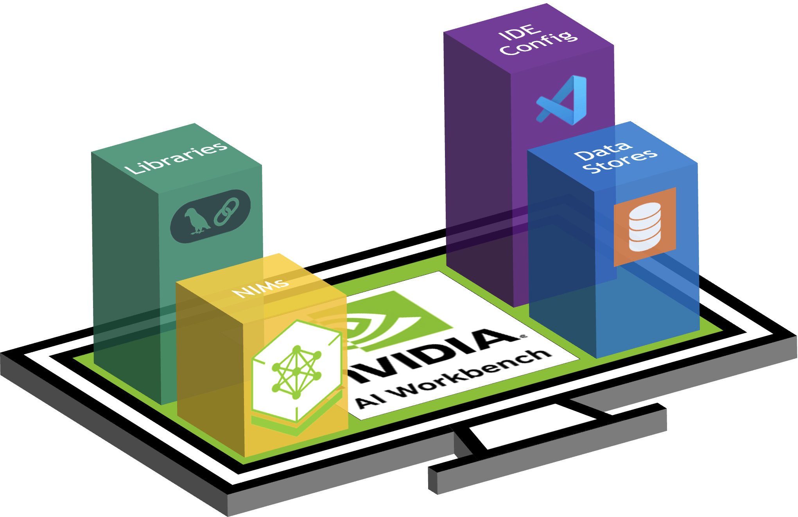
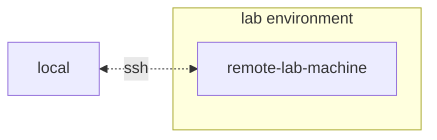
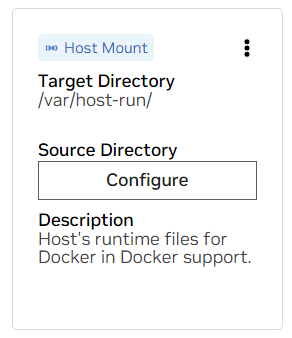
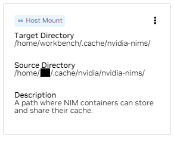
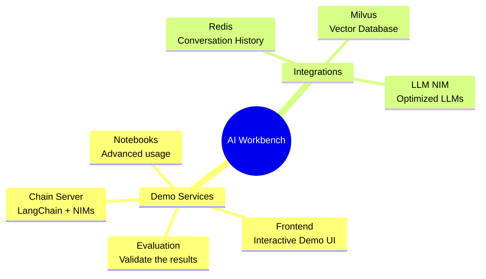

# NVIDIA NIM Anywhere [](https://nvidia.github.io/nim-anywhere/clone_me.html)


[](https://docs.nvidia.com/nim/#large-language-models)
[](https://docs.nvidia.com/nim/#nemo-retriever)
[](https://docs.nvidia.com/nim/#nemo-retriever)
[](https://github.com/NVIDIA/nim-anywhere/actions/workflows/ci.yml?query=branch%3Amain)


 
An entrypoint for developing with NIMs that natively scales out to
full-sized labs and up to production environments. NIM Anywhere is an
integration of all the tooling required to start integrating NVIDIA
enterprise-ready microservices.

Get started now with the [quick start](#quick-start) instructions.


 
- [Quick Start](#quick-start)
  - [Generate your NGC Personal Key](#generate-your-ngc-personal-key)
  - [Install AI Workbench](#install-ai-workbench)
  - [Download this project](#download-this-project)
  - [Configure this project](#configure-this-project)
  - [Start This Project](#start-this-project)
  - [Populating the Knowledge Base](#populating-the-knowledge-base)
- [Developing Your Own Applications](#developing-your-own-applications)

# Quick Start

## Generate your NGC Personal Key

To allow AI Workbench to access NVIDIA’s cloud resources, you’ll need to
provide it with a Personal Key. These keys begin with `nvapi-`.

<details>
<summary>
<b>Expand this section for instructions for creating this key.</b>
</summary>

1.  Go to the [NGC Personal Key
    Manager](https://org.ngc.nvidia.com/setup/personal-keys). If you are
    prompted to, then register for a new account and sign in.

    > **HINT** You can find this tool by logging into
    > [ngc.nvidia.com](https://ngc.nvidia.com), expanding your profile
    > menu on the top right, selecting *Setup*, and then selecting
    > *Generate Personal Key*.

2.  Select *Generate Personal Key*.

    

3.  Enter any value as the Key name, an expiration of 12 months is fine,
    and select all four services. Press *Generate Personal Key* when you
    are finished.

    

4.  Save your personal key for later. Workbench will need it and there
    is no way to retrieve it later. If the key is lost, a new one must
    be created. Protect this key as if it were a password.

    

</details>

## Install AI Workbench

This project is designed to be used with [NVIDIA AI
Workbench](https://www.nvidia.com/en-us/deep-learning-ai/solutions/data-science/workbench/).
While this is not a requirement, running this demo without AI Workbench
will require manual work as the pre-configured automation and
integrations may not be available.

This quick start guide will assume a remote lab machine is being used
for development and the local machine is a thin-client for remotely
accessing the development machine. This allows for compute resources to
stay centrally located and for developers to be more portable. Note, the
remote lab machine must run Ubuntu, but the local client can run
Windows, MacOS, or Ubuntu. To install this project local only, simply
skip the remote install.



### Client Machine Install

Ubuntu is required if the local client will also be used for developent.
When using a remote lab machine, this can be Windows, MacOS, or Ubuntu.

<details>
<summary>
<b>Expand this section for a Windows install.</b>
</summary>

For full instructions, see the [NVIDIA AI Workbench User
Guide](https://docs.nvidia.com/ai-workbench/user-guide/latest/installation/windows.html).

1.  Install Prerequisite Software

    1.  If this machine has an NVIDIA GPU, ensure the GPU drivers are
        installed. It is recommended to use the [GeForce
        Experience](https://www.nvidia.com/en-us/geforce/geforce-experience/)
        tooling to manage the GPU drivers.
    2.  Install [Docker
        Desktop](https://www.docker.com/products/docker-desktop/) for
        local container support. Please be mindful of Docker Desktop's
        licensing for enterprise use. [Rancher
        Desktop](https://rancherdesktop.io/) may be a viable
        alternative.
    3.  *\[OPTIONAL\]* If Visual Studio Code integration is desired,
        install [Visual Studio Code](https://code.visualstudio.com/).

2.  Download the [NVIDIA AI
    Workbench](https://www.nvidia.com/en-us/deep-learning-ai/solutions/data-science/workbench/)
    installer and execute it. Authorize Windows to allow the installer
    to make changes.

3.  Follow the instructions in the installation wizard. If you need to
    install WSL2, authorize Windows to make the changes and reboot when
    requested. When the system restarts, the NVIDIA AI Workbench
    installer should automatically resume.

4.  Select Docker as your container runtime.

5.  Log into your GitHub Account by using the *Sign in through
    GitHub.com* option.

6.  Enter your git author information if requested.

</details>

<details>
<summary>
<b>Expand this section for a MacOS install.</b>
</summary>

For full instructions, see the [NVIDIA AI Workbench User
Guide](https://docs.nvidia.com/ai-workbench/user-guide/latest/installation/macos.html).

1.  Install Prerequisite Software

    1.  Install [Docker
        Desktop](https://www.docker.com/products/docker-desktop/) for
        local container support. Please be mindful of Docker Desktop's
        licensing for enterprise use. [Rancher
        Desktop](https://rancherdesktop.io/) may be a viable
        alternative.
    2.  *\[OPTIONAL\]* If Visual Studio Code integration is desired,
        install [Visual Studio Code](https://code.visualstudio.com/).
        When using VSCode on a Mac, an a[dditional step must be
        performed](https://code.visualstudio.com/docs/setup/mac#_launching-from-the-command-line)
        to install the VSCode CLI interface used by Workbench.

2.  Download the [NVIDIA AI
    Workbench](https://www.nvidia.com/en-us/deep-learning-ai/solutions/data-science/workbench/)
    disk image (*.dmg* file) and open it.

3.  Drag AI Workbench into the Applications folder and run *NVIDIA AI
    Workbench* from the application launcher. 

4.  Select Docker as your container runtime.

5.  Log into your GitHub Account by using the *Sign in through
    GitHub.com* option.

6.  Enter your git author information if requested.

</details>

<details>
<summary>
<b>Expand this section for an Ubuntu install.</b>
</summary>

For full instructions, see the [NVIDIA AI Workbench User
Guide](https://docs.nvidia.com/ai-workbench/user-guide/latest/installation/ubuntu-local.html).
Run this installation as the user who will be user Workbench. Do not run
these steps as `root`.

1.  Install Prerequisite Software

    1.  *\[OPTIONAL\]* If Visual Studio Code integration is desired,
        install [Visual Studio Code](https://code.visualstudio.com/).

2.  Download the [NVIDIA AI
    Workbench](https://www.nvidia.com/en-us/deep-learning-ai/solutions/data-science/workbench/)
    installer, make it executable, and then run it. You can make the
    file executable with the following command:

    ``` bash
    chmod +x NVIDIA-AI-Workbench-*.AppImage
    ```

3.  AI Workbench will install the NVIDIA drivers for you (if needed).
    You will need to reboot your machine after the drivers are installed
    and then restart the AI Workbench installation by double-clicking
    the NVIDIA AI Workbench icon on your desktop.

4.  Select Docker as your container runtime.

5.  Log into your GitHub Account by using the *Sign in through
    GitHub.com* option.

6.  Enter your git author information if requested.

</details>

### Remote Machine Install

Only Ubuntu is supported for remote machines.

<details>
<summary>
<b>Expand this section for a remote Ubuntu install.</b>
</summary>

For full instructions, see the [NVIDIA AI Workbench User
Guide](https://docs.nvidia.com/ai-workbench/user-guide/latest/installation/ubuntu-remote.html).
Run this installation as the user who will be using Workbench. Do not
run these steps as `root`.

1.  Ensure SSH Key based authentication, without a passphrase, is
    enabled from the local machine to the remote machine. If this is not
    currently enabled, the following commands will enable this is most
    situations.

    - From a Windows local client, use the following PowerShell:
      ``` powershell
      ssh-keygen -f "C:\Users\local-user\.ssh\id_rsa" -t rsa -N '""'
      type $env:USERPROFILE\.ssh\id_rsa.pub | ssh REMOTE_USER@REMOTE-MACHINE "cat >> .ssh/authorized_keys"
      ```
    - From a MacOS or Linux local client, use the following shell:
      ``` bash
      if [ ! -e ~/.ssh/id_rsa ]; then ssh-keygen -f ~/.ssh/id_rsa -t rsa -N ""; fi
      ssh-copy-id REMOTE_USER@REMOTE-MACHINE
      ```

2.  SSH into the remote host. Then, use the following commands to
    download and execute the NVIDIA AI Workbench Installer.

    ``` bash
    mkdir -p $HOME/.nvwb/bin && \
    curl -L https://workbench.download.nvidia.com/stable/workbench-cli/$(curl -L -s https://workbench.download.nvidia.com/stable/workbench-cli/LATEST)/nvwb-cli-$(uname)-$(uname -m) --output $HOME/.nvwb/bin/nvwb-cli && \
    chmod +x $HOME/.nvwb/bin/nvwb-cli && \
    sudo -E $HOME/.nvwb/bin/nvwb-cli install
    ```

3.  AI Workbench will install the NVIDIA drivers for you (if needed).
    You will need to reboot your machine after the drivers are installed
    and then restart the AI Workbench installation by re-running the
    commands in the previous step.

4.  Select Docker as your container runtime.

5.  Log into your GitHub Account by using the *Sign in through
    GitHub.com* option.

6.  Enter your git author information if requested.

7.  Once the remote installation is complete, the Remote Location can be
    added to the local AI Workbench instance. Open the AI Workbench
    application, click *Add Remote Location*, and then enter the
    required information. When finished, click *Add Location*.

    - \*Location Name: \* Any short name for this new location
    - \*Description: \* Any brief metadata for this location.
    - \*Hostname or IP Address: \* The hostname or address used to
      remotely SSH. If step 1 was followed, this should be the same as
      `REMOTE-MACHINE`.
    - \*SSH Port: \* Usually left blank. If a nonstandard SSH port is
      used, it can be configured here.
    - \*SSH Username: \* The username used for making an SSH connection.
      If step 1 was followed, this should be the same as `REMOTE_USER`.
    - \*SSH Key File: \* The path to the private key for making SSH
      connections. If step 1 was followed, this should be:
      `/home/USER/.ssh/id_rsa`.
    - \*Workbench Directory: \* Usually left blank. This is where
      Workbench will remotely save state.

</details>

## Download this project

There are two ways to download this project for local use: Cloning and
Forking.

Cloning this repository is the recommended way to start. This will not
allow for local modifications, but is the fastest to get started. This
also allows for the easiest way to pull updates.

Forking this repository is recommended for development as changes will
be able to be saved. However, to get updates, the fork maintainer will
have to regularly pull from the upstream repo. To work from a fork,
follow [GitHub's
instructions](https://docs.github.com/en/pull-requests/collaborating-with-pull-requests/working-with-forks/fork-a-repo)
and then reference the URL to your personal fork in the rest of this
section.

<details>
<summary>
<b>Expand this section for a details on downloading this project.</b>
</summary>

1.  Open the local NVIDIA AI Workbench window. From the list of
    locations displayed, select one you would like to work in.

    

2.  Once inside the location, select *Clone Project*.

    

3.  Enter the URL of the project repository. You may leave the path as
    the default value. Press *Clone*. If you are cloning this project,
    the url will be: `https://github.com/NVIDIA/nim-anywhere.git`

    

4.  You will be redirected to the new project’s page. Workbench will
    automatically bootstrap the development environment. You can view
    real-time progress by expanding the Output from the bottom of the
    window.

    

</details>

## Configure this project

The project must be configured to work with local machine resources.

<details>
<summary>
<b>Expand this section for a details on configuring this project.</b>
</summary>

1.  Before running for the first time, project specific configuration
    must be provided. Project configuration is done using the
    *Environment* tab from the left-hand panel.

    

2.  Scroll down to the **Variables** section and find *NGC_HOME* entry.
    It should be set to something like `~/.cache/nvidia-nims`. The value
    here is used by workbench. This same location also appears in the
    **Mounts** section that mounts this directory into the container.

3.  Scroll down to the **Secrets** section and find the *NGC_API_KEY*
    entry. Press *Configure* and provide the personal key for NGC that
    as generated earlier.

4.  Scroll down to the **Mounts** section. Here, there are two mounts to
    configure.

    a\. Find the mount for /var/host-run. This is used to allow the
    development environment to access the host’s Docker daemon in a
    pattern called Docker out of Docker. Press **Configure** and provide
    the directory `/var/run`.

    

    b\. Find the mount for /home/workbench/.cache/nvidia-nims. This
    mount is used as a runtime cache for NIMs where they can cache model
    files. Sharing this cache with the host reduces disk usage and
    network bandwidth.

    

    If you don't already have a nim cache, or you aren't sure, use the
    following commands to create one at `/home/USER/.cache/nvidia-nims`.

    ``` bash
    mkdir -p ~/.cache/nvidia-nims
    chmod 2777 ~/.cache/nvidia-nims
    ```

5.  A rebuild will occur after these settings have been changed.

6.  Once the build completes with a *Build Ready* message, all
    applications will be made available to you.

</details>

## Start This Project

Even the most basic of LLM Chains depend on a few additional
microservices. These can be ignored during development for in-memory
alternatives, but then code changes are required to go to production.
Thankfully, Workbench manages those additional microservices for
development environments.

<details>
<summary>
<b>Expand this section for details on starting the demo application.</b>
</summary>

> **HINT:** For each application, the debug output can be monitored in
> the UI by clicking the Output link in the lower left corner, selecting
> the dropdown menu, and choosing the application of interest.

1.  All applications bundled in this workspace can be controlled by
    navigating to **Environment** \> **Applications**.

2.  First, toggle on *Milvus Vector DB* and *Redis*. Milvus is used as
    an unstructured knowledge base and Redis is used to store
    conversation histories.

3.  Once these services have been started, the *Chain Server* can safely
    be started. This contains the custom LangChain code for performing
    our reasoning chain. By default, it will use the local Milvus and
    Redis, but use *ai.nvidia.com* for LLM and Embedding model
    inferencing.

4.  **\[OPTIONAL\]:** Next, start the *LLM NIM*. The first time the LLM
    NIM is started, it will take some time to download the image and the
    optimized models.

    a\. During a long start, to confirm the LLM NIM is starting, the
    progress can be observed by viewing the logs by using the *Output*
    pane on the bottom left of the UI.

    b\. If the logs indicate an authentication error, that means the
    provided *NGC_API_KEY* does not have access to the NIMs. Please
    verify it was generated correctly and in an NGC organization that
    has NVIDIA AI Enterprise support or trial.

    c\. If the logs appear to be stuck on `..........: Pull complete`.
    `..........: Verifying complete`, or
    `..........: Download complete`; this is all normal output from
    Docker that the various layers of the container image have been
    downloaded.

    d\. Any other failures here need to be addressed.

5.  Once the *Chain Server* is up, the *Chat Interface* can be started.
    Starting the interface will automatically open it in a browser
    window.


</details>

## Populating the Knowledge Base

To get started developing demos, a sample dataset is provided along with
a Jupyter Notebook showing how data is ingested into a Vector Database.

1.  To import PDF documentation into the vector Database, open Jupyter
    using the app launcher in AI Workbench.

2.  Use the Jupyter Notebook at `code/upload-pdfs.ipynb` to ingest the
    default dataset. If using the default dataset, no changes are
    necessary.

3.  If using a custom dataset, upload it to the `data/` directory in
    Jupyter and modify the provided notebook as necessary.

# Developing Your Own Applications

This project contains applications for a few demo services as well as
integrations with external services. These are all orchestrated by
[NVIDIA AI
Workbench](https://www.nvidia.com/en-us/deep-learning-ai/solutions/data-science/workbench/).

The demo services are all in the `code` folder. The root level of the
code folder has a few interactive notebooks meant for technical deep
dives. The Chain Server is a sample application utilizing NIMs with
LangChain. The Chat Frontend folder contains an interactive UI server
for exercising the chain server. Finally, sample notebooks are provided
in the Evaluation directory to demonstrate retrieval scoring and
validation.


