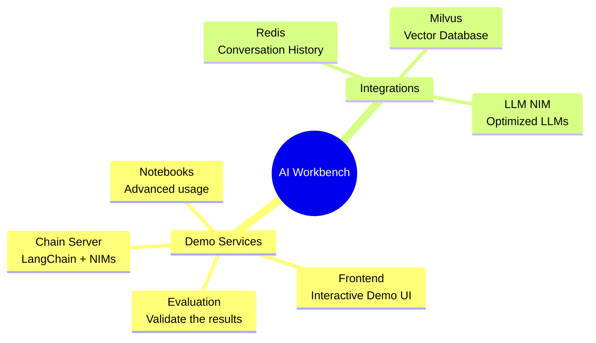
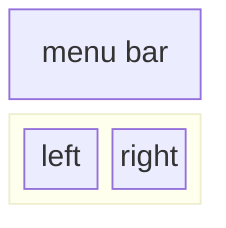
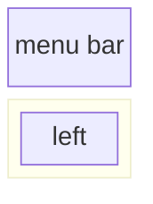
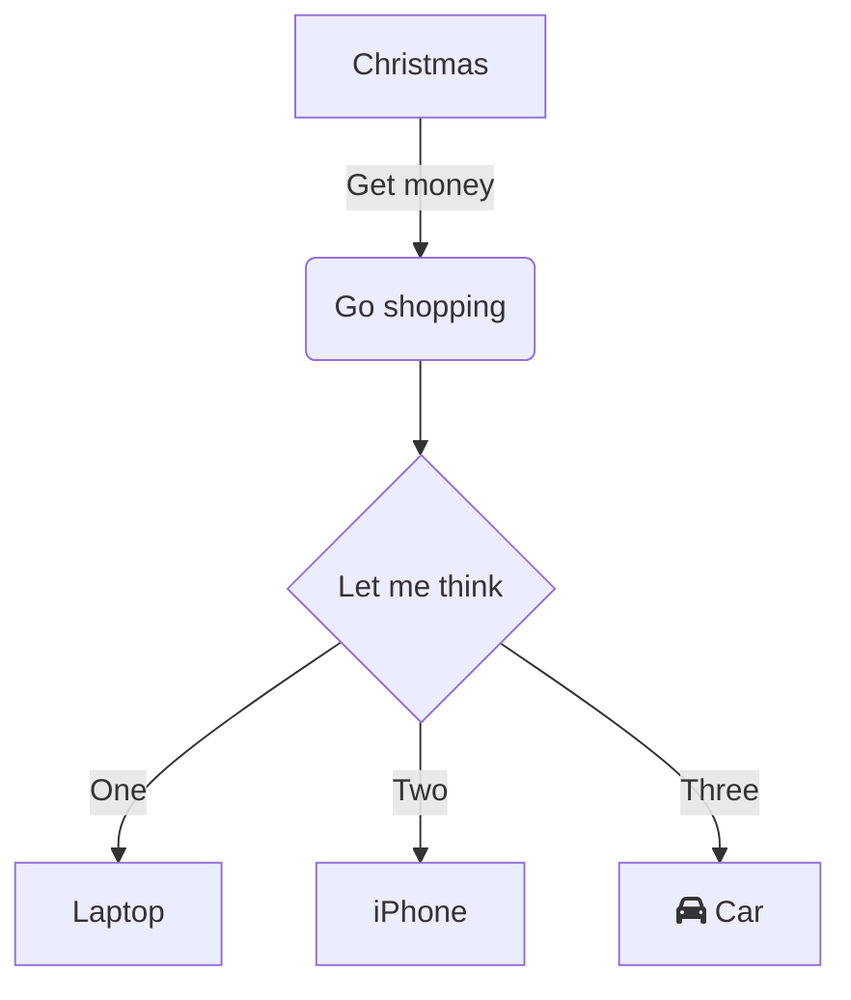

  - [<span class="toc-section-number">1</span> NIM Anywhere Developer
    Documentation](#nim-anywhere-developer-documentation)
      - [<span class="toc-section-number">1.1</span> Project
        Components](#project-components)
      - [<span class="toc-section-number">1.2</span> Getting
        Started](#getting-started)
          - [<span class="toc-section-number">1.2.1</span>
            Pre-requisites](#pre-requisites)
          - [<span class="toc-section-number">1.2.2</span> AI Workbench
            Quickstart](#ai-workbench-quickstart)
          - [<span class="toc-section-number">1.2.3</span> Cloning the
            project](#cloning-the-project)
          - [<span class="toc-section-number">1.2.4</span> Running the
            project](#running-the-project)
          - [<span class="toc-section-number">1.2.5</span> Populating
            the Knowledge Base](#populating-the-knowledge-base)
  - [<span class="toc-section-number">2</span> Application
    Configuration](#application-configuration)
      - [<span class="toc-section-number">2.1</span> Config from a
        file](#config-from-a-file)
      - [<span class="toc-section-number">2.2</span> Config from a
        custom file](#config-from-a-custom-file)
      - [<span class="toc-section-number">2.3</span> Config from env
        vars](#config-from-env-vars)
      - [<span class="toc-section-number">2.4</span> Chain Server config
        schema](#chain-server-config-schema)
      - [<span class="toc-section-number">2.5</span> Chat Frontend
        config schema](#chat-frontend-config-schema)
  - [<span class="toc-section-number">3</span>
    Contributing](#contributing)
      - [<span class="toc-section-number">3.1</span> Updating the
        frontend](#updating-the-frontend)
          - [<span class="toc-section-number">3.1.1</span> Creating a
            new page](#creating-a-new-page)
          - [<span class="toc-section-number">3.1.2</span> Adding a
            view](#adding-a-view)
          - [<span class="toc-section-number">3.1.3</span> Frontend
            branding](#frontend-branding)
          - [<span class="toc-section-number">3.1.4</span> Messaging
            between pages](#messaging-between-pages)
      - [<span class="toc-section-number">3.2</span> Updating
        documentation](#updating-documentation)
          - [<span class="toc-section-number">3.2.1</span> Dynamic
            documentation](#dynamic-documentation)
          - [<span class="toc-section-number">3.2.2</span> HTML
            template](#html-template)
          - [<span class="toc-section-number">3.2.3</span> Publishing
            documentation](#publishing-documentation)
          - [<span class="toc-section-number">3.2.4</span> Mermaid
            support](#mermaid-support)
  - [<span class="toc-section-number">4</span> Managing your
    Developement Environment](#managing-your-developement-environment)
      - [<span class="toc-section-number">4.1</span> Environment
        Variables](#environment-variables)
      - [<span class="toc-section-number">4.2</span> Python Environment
        Packages](#python-environment-packages)
      - [<span class="toc-section-number">4.3</span> Operating System
        Configuration](#operating-system-configuration)

# NIM Anywhere Developer Documentation

NIM Anywhere serves two purposes as a rapid NVIDIA NIM demonstrator as
well as a starting point for developing with NIMs. The intention is to
democratize access to NIMs and demonstrate the value of NIMs.


## Project Components

This project contains applications for a few demo services as well as
integrations with external services. These are all orchestrated by
[NVIDIA AI
Workbench](https://www.nvidia.com/en-us/deep-learning-ai/solutions/data-science/workbench/).

The demo services are all in the `code` folder. The root level of the
code folder has a few interactive notebooks meant for technical deep
dives. The Chain Server is a sample application utilizing NIMs with
LangChain. The Chat Frontend folder contains an interactive UI server
for excersising the chain server. Finally, sample notebooks are provided
in the Evaluation directory to demonstrate retriveval scoring and
validation.



## Getting Started

This project is designed to be used with [NVIDIA AI
Workbench](https://www.nvidia.com/en-us/deep-learning-ai/solutions/data-science/workbench/).
While this is not a requirement, running this demo without AI Workbench
will require manual work as the pre-configured automation and
integrations may not be available.

### Pre-requisites

  - NVIDIA Driver
  - Docker
  - Ubuntu 22.04 on the developemnt machine

### AI Workbench Quickstart

1.  Download execute the NVIDIA AI Workbench Installer.
2.  Run the installation
      - Select Docker during the install
      - Perform any manual installs that are requested
3.  If you are working on a remote machine, run the remote install of
    Workbench on that machine as well.
4.  Open the Workbench UI
5.  Go to the settings and configure the integration with GitHub.
6.  If you are working on a remote machine, add the remote machine as a
    location.

### Cloning the project

1.  Open the desired location in AI Workbench
2.  Select `Clone Project`
3.  Enter this repository in the repository URL
4.  The default path is fine, but it can be modified as desired
5.  Open the clonded project in the workbench UI then configure the
    secrets and mounts

### Running the project

1.  In the Workbench project navigate to `Environment` -\> `Apps`
2.  Start Redis, Milvus, and the NIM (if local execution is desired).
    Wait for these to finish.
3.  Start the Chain Server. The Chain Server has a UI that can be
    launched from Workbench. This UI is good for development and shows
    full chain traces.
4.  Start the Chat Frontend. This will automatically open the UI.

### Populating the Knowledge Base

1.  To import PDF documentation into the vector databse, open Jupyter.
2.  Use the `upload-pdfs.ipynb` notebook to ingest the default dataset.
    If ussing the default dataset, no changes are necessary.
3.  If using a custom dataset, upload it to the `data` directory in
    Jupyter and modify the provided notebook as necessary.

# Application Configuration

The Chain Server can be configured with either a configuration file or
environment variables.

## Config from a file

By default, the application will search for a configuration file in all
of the following locations. If multiple configuration files are found,
values from lower files in the list will take precendence.

  - ./config.yaml
  - ./config.yml
  - ./config.json
  - \~/app.yaml
  - \~/app.yml
  - \~/app.json
  - /etc/app.yaml
  - /etc/app.yml
  - /etc/app.json

## Config from a custom file

An additional config file path can be specified through an environment
variable named `APP_CONFIG`. The value in this file will take precedence
over all the default file locations.

``` bash
export APP_CONFIG=/etc/my_config.yaml
```

## Config from env vars

Configuration can also be set using environment variables. The variable
names will be in the form: `APP_FIELD__SUB_FIELD` Values specified as
environment variables will take precedence over all values from files.

## Chain Server config schema

``` yaml
# Your API key for authentication to AI Foundation.
# ENV Variables: NGC_API_KEY, NVIDIA_API_KEY, APP_NVIDIA_API_KEY
# Type: string, null
nvidia_api_key: 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

# The Data Source Name for your Redis DB.
# ENV Variables: APP_REDIS_DSN
# Type: string
redis_dsn: redis://localhost:6379/0

chat_model: 
    # The name of the model to request.
    # ENV Variables: APP_CHAT_MODEL__NAME
    # Type: string
    name: meta/llama3-70b-instruct

    # The URL to the model API.
    # ENV Variables: APP_CHAT_MODEL__URL
    # Type: string
    url: https://integrate.api.nvidia.com/v1


embedding_model: 
    # The name of the model to request.
    # ENV Variables: APP_EMBEDDING_MODEL__NAME
    # Type: string
    name: NV-Embed-QA


milvus: 
    # The host machine running Milvus vector DB.
    # ENV Variables: APP_MILVUS__URL
    # Type: string
    url: http://localhost:19530

    # The name of the Milvus collection.
    # ENV Variables: APP_MILVUS__COLLECTION_NAME
    # Type: string
    collection_name: collection_1


# Options for the logging levels.
# ENV Variables: APP_LOG_LEVEL
log_level: WARNING

```

## Chat Frontend config schema

The chat frontend has a few configuraiton options as well. They can be
set in the same manner as the chain server.

``` yaml
# The URL to the chain on the chain server.
# ENV Variables: APP_CHAIN_URL
# Type: string
chain_url: http://localhost:3030/

# The url prefix when this is running behind a proxy.
# ENV Variables: PROXY_PREFIX, APP_PROXY_PREFIX
# Type: string
proxy_prefix: /

# Path to the chain server's config.
# ENV Variables: APP_CHAIN_CONFIG_FILE
# Type: string
chain_config_file: ./config.yaml

# Options for the logging levels.
# ENV Variables: APP_LOG_LEVEL
log_level: INFO

```

# Contributing

All feedback and contributions to this project are welcome. When making
changes to this project, either for personal use or for contributing, it
is recomended to work on a fork on this project. Once the changes have
been completed on the fork, a Merge Request should be opened.

## Updating the frontend

The frontend has been designed in an effort to minimize the required
HTML and Javascript development. A branded and styled Application Shell
is provided that has been created with vanilla HTML, Javascript, and
CSS. It is designed to be easy to customize, but it should never be
required. The interactive components of the frontend are all created in
Gradio and mounted in the app shell using iframes.

Along the top of the app shell is a menu listing the avaiable views.
Each view may have its own layout consisting of one or a few pages.

### Creating a new page

Pages contain the interactive components for a demo. The code for the
pages is in the `code/frontend/pages` directory. To create a new page:

1.  Create a new folder in the pages directory
2.  Create an `__init__.py` file in the new directory that uses Gradio
    to define the UI. The Gradio Blocks layout should be defined in a
    variable called `page`.
3.  It is recomended that any CSS and JS files needed for this view be
    saved in the same directory. See the `chat` page for an example.
4.  Open the `code/frontend/pages/__init__.py` file, import the new
    page, and add the new page to the `__all__` list.

> **NOTE:** Creating a new page will not add it to the frontend. It must
> be added to a view to appear on the Frontend.

### Adding a view

View consist of one or a few pages and should function independantly of
each other. Views are all defined in the `code/frontend/server.py`
module. All declared views will automatically be added to the Frontend’s
menu bar and made available in the UI.

To define a new view, modify the list named `views`. This is a list of
`View` objects. The order of the objects will define their order in the
Frontend menu. The first defined view will be the default.

View objects describe the view name and layout. They can be declared as
follow:

``` python
my_view = frontend.view.View(
  name="My New View",  # the name in the menu
  left=frontend.pages.sample_page,  # the page to show on the left
  right=frontend.pages.another_page,  # the page to show on the right
)
```

All of the page declarations, `View.left` or `View.right`, are optional.
If they are not declared, then the associated iframes in the web layout
will be hidden. The other iframes will expand to fill the gaps. The
following diagrams show the various layouts.

  - All pages are defined

<!-- end list -->



  - Only left is defined

<!-- end list -->



### Frontend branding

The frontend contains a few branded assets that can be customized for
different use cases.

#### Logo

The frontend contains a logo on the top left of the page. To modify the
logo, an SVG of the desired logo is required. The app shell can then be
easily modified to use the new SVG by modifying the
`code/frontend/_assets/index.html` file. There is a single `div` with an
ID of `logo`. This box contains a single SVG. Update this to the desired
SVG definition.

``` html
<div id="logo" class="logo">
    <svg viewBox="0 0 164 30">...</svg>
</div>
```

#### Color scheme

The styling of the App Shell is defined in
`code/frontend/_static/css/style.css`. The colors in this file may be
safely modfied.

The styling of the various pages are defined in
`code/frontend/pages/*/*.css`. These files may also require modification
for custom color schemes.

#### Gradio theme

The Gradio theme is defined in the file
`code/frontend/_assets/theme.json`. The colors in this file can safely
be modified to the desired branding. Other styles in this file may also
be changed, but may cause breaking changes to the frontend. The [Gradio
documentation](https://www.gradio.app/guides/theming-guide) contains
more information on Gradio theming.

### Messaging between pages

> **NOTE:** This is an advanced topic that most developers will never
> require.

Occasionally, it may be necessary to have multiple pages in a view that
communicate with each other. For this purpose, Javascript’s
`postMessage` messaging framework is used. Any trusted message posted to
the application shell will be forwarded to each iframe where the pages
can handle the message as desired. The `control` page uses this feature
to modify the configuration of the `chat` page.

The following will post a message to the app shell (`window.top`). The
message will contain a dictionary with the key `use_kb` and a value of
true. Using Gradio, this Javascript can be executed by [any Gradio
event](https://www.gradio.app/guides/custom-CSS-and-JS#adding-custom-java-script-to-your-demo).

``` javascript
window.top.postMessage({"use_kb": true}, '*');
```

This message will automatically be sent to all pages by the app shell.
The following sample code will consume the message on another page. This
code will run asynchronously when a `message` event is recieved. If the
message is trusted, a Gradio component with the `elem_id` of `use_kb`
will be updated to the value specified in the message. In this way, the
value of a Gradio component can be duplicated across pages.

``` javascript
window.addEventListener(
  "message",
  (event) => {
      if (event.isTrusted) {
          use_kb = gradio_config.components.find((element) => element.props.elem_id == "use_kb");
          use_kb.props.value = event.data["use_kb"];
      };
  },
  false);
```

## Updating documentation

Documentation is written in Markdown format and then rendered to HTML
using Pandoc. The documentation can be opened using the application
drawer to start the Documentation server. Restarting the documentation
server will update the documentation to reflect changes.

All documentation is in the `docs` folder. Any markdown files in this
folder will be concatenated, in alphabetic order, to produce the full
manual.

Save all static content, including images, to the `_static` folder.
Static content outside of this folder may work in Markdown format, but
will break in HTML format.

### Dynamic documentation

It may be helpful to have documents that update and write themselves. To
create a dynamic document, simply create a Python script with the
`.md.py` extension. The script must be executable and should write the
Markdown formatted document to stdout. During build time, this script
will be run to update the markdown file with the same name.

### HTML template

There are two files that control the template.

  - `.template.html` is the HTML template used by Pandoc. It is based
    heavily on a project called [Easy Pandoc
    Templates](https://github.com/ryangrose/easy-pandoc-templates). This
    file can be customized or replaced to change how to documentation
    looks. For tips on doing this, check out the [Pandoc
    documentation](https://pandoc.org/MANUAL.html#templates).
  - `.puppeteer.json` is a configuration file used in Mermaid rendering.
    There is not likely to be a situation where modifying this is
    necessary.

### Publishing documentation

`Make` can be used to manage the lifecycle of the documentation.

  - `make render` will render all of the dynamic documentation pages to
    Markdown
  - `make build` will build the documentation HTML from Markdown
  - `make clean` will clean all cached builds
  - `make serve` will start a local webserver for viewing the
    documentation
  - `make stop` will stop a running webserver
  - `make status` will check the status of the webserver

### Mermaid support

The documentation supports creating dynamic flowcharts using mermaid.
This is done using the
[mermaid-filter](https://github.com/raghur/mermaid-filter) extension for
Pandoc. To include a diagram in your documentation, include something
like this:

```` markdown

````

For help with the Mermaid syntax, reference the [Mermaid
documentation](https://mermaid.js.org/intro/) and check out the [Mermaid
Live Editor](https://mermaid.live/).

# Managing your Developement Environment

## Environment Variables

Most of the configuration for the development environment happens with
Environment Variables. To make permanent changes to environment
variables, modify [`variables.env`](./variables.env) or use the
Workbench UI.

## Python Environment Packages

This project uses one Python environment at `/usr/bin/python3` and
dependencies are managed with `pip`. Becuse all development is done
inside a container, any changes to the Python environment will be
ephemeral. To permanently install a Python package, add it to the
[`requirements.txt`](./requirements.txt) file or use the Workbench UI.

## Operating System Configuration

The development environment is based on Ubuntu 22.04. The primary user
has password-less sudo access, but all changes to the system will be
ephemeral. To make permanent changes to installed packages, add them to
the \[`apt.txt`\] file. To make other changes to the operating system
such as manipulating files, adding environment variables, etc; use the
[`podBuild.bash`](./postBuild.bash) and
[`preBuild.bash`](./preBuild.bash) files.
