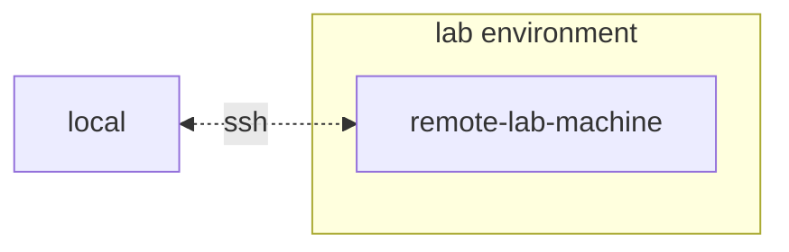
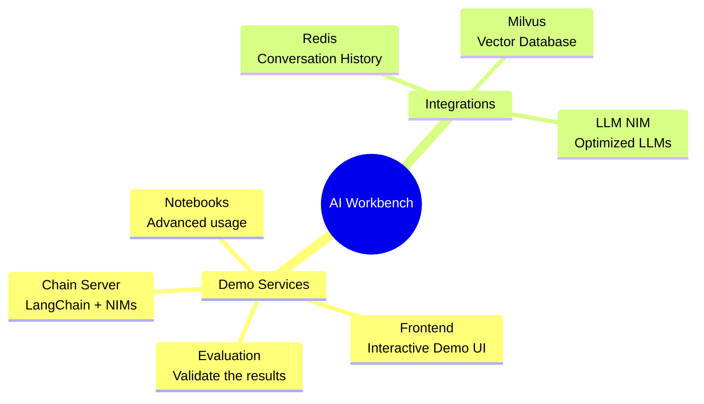
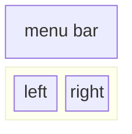
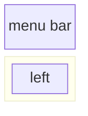

# NVIDIA NIM Anywhere

An entrypoint for developing with NIMs that natively scales out to
full-sized labs and up to production environments. NIM Anywhere is an
integration of all the tooling required to start integrating NVIDIA
enterprise-ready microservices.

Get started now with the [quick start](#quick-start) instructions.


 
  - [Quick Start](#quick-start)
      - [Generate your NGC Personal
        Key](#generate-your-ngc-personal-key)
      - [Install AI Workbench](#install-ai-workbench)
      - [Download this project](#download-this-project)
      - [Configure this project](#configure-this-project)
      - [Start This Project](#start-this-project)
      - [Populating the Knowledge Base](#populating-the-knowledge-base)
  - [Developing Your Own
    Applications](#developing-your-own-applications)
  - [Application Configuration](#application-configuration)
      - [Config from a file](#config-from-a-file)
      - [Config from a custom file](#config-from-a-custom-file)
      - [Config from env vars](#config-from-env-vars)
      - [Chain Server config schema](#chain-server-config-schema)
      - [Chat Frontend config schema](#chat-frontend-config-schema)
  - [Contributing](#contributing)
      - [Updating the frontend](#updating-the-frontend)
      - [Updating documentation](#updating-documentation)
  - [Managing your Developement
    Environment](#managing-your-developement-environment)
      - [Environment Variables](#environment-variables)
      - [Python Environment Packages](#python-environment-packages)
      - [Operating System
        Configuration](#operating-system-configuration)
      - [Updating Dependencies](#updating-dependencies)

# Quick Start

## Generate your NGC Personal Key

To allow AI Workbench to access NVIDIA’s cloud resources, you’ll need to
provide it with a Personal Key. These keys begin with `nvapi-`.

<details>
<summary>
<b>Expand this section for instructions for creating this key.</b>
</summary>

1.  Go to the [NGC Personal Key
    Manager](https://org.ngc.nvidia.com/setup/personal-keys). If you are
    prompted to, then register for a new account and sign in.
    
    > **HINT** You can find this tool by logging into
    > [ngc.nvidia.com](ngc.nvidia.com), expanding your profile menu on
    > the top right, selecting *Setup*, and then selecting *Generate
    > Personal Key*.

2.  Select *Generate Personal Key*.
    
    

3.  Enter any value as the Key name, an expiration of 12 months is fine,
    and select all four services. Press *Generate Personal Key* when you
    are finished.
    
    

4.  Save your personal key for later. Workbench will need it and there
    is no way to retrieve it later. If the key is lost, a new one must
    be created. Protect this key as if it were a password.
    
    

</details>

## Install AI Workbench

This project is designed to be used with [NVIDIA AI
Workbench](https://www.nvidia.com/en-us/deep-learning-ai/solutions/data-science/workbench/).
While this is not a requirement, running this demo without AI Workbench
will require manual work as the pre-configured automation and
integrations may not be available.

This quick start guide will assume a remote lab machine is being used
for development and the local machine is a thin-client for remotely
accessing the development machine. This allows for compute resources to
stay centrally located and for developers to be more portable. Note, the
remote lab machine must run Ubuntu, but the local client can run
Windows, MacOS, or Ubuntu. To install this project local only, simply
skip the remote install.



### Client Machine Install

Ubuntu is required if the local client will also be used for developent.
When using a remote lab machine, this can be Windows, MacOS, or Ubuntu.

<details>
<summary>
<b>Expand this section for a Windows install.</b>
</summary>

For full instructions, see the [NVIDIA AI Workbench User
Guide](https://docs.nvidia.com/ai-workbench/user-guide/latest/installation/windows.html).

1.  Install Prerequisite Software
    
    1.  If this machine has an NVIDIA GPU, ensure the GPU drivers are
        installed. It is recommended to use the [GeForce
        Experience](https://www.nvidia.com/en-us/geforce/geforce-experience/)
        tooling to manage the GPU drivers.
    2.  Install [Docker
        Desktop](https://www.docker.com/products/docker-desktop/) for
        local container support. Please be mindful of Docker Desktop's
        licensing for enterprise use. [Rancher
        Desktop](https://rancherdesktop.io/) may be a viable
        alternative.
    3.  *\[OPTIONAL\]* If Visual Studio Code integration is desired,
        install [Visual Studio Code](https://code.visualstudio.com/).

2.  Download the [NVIDIA AI
    Workbench](https://www.nvidia.com/en-us/deep-learning-ai/solutions/data-science/workbench/)
    installer and execute it. Authorize Windows to allow the installer
    to make changes.

3.  Follow the instructions in the installation wizard. If you need to
    install WSL2, authorize Windows to make the changes and reboot when
    requested. When the system restarts, the NVIDIA AI Workbench
    installer should automatically resume.

4.  Select Docker as your container runtime.

5.  Log into your GitHub Account by using the *Sign in through
    GitHub.com* option.

6.  Enter your git author information if requested.

</details>

<details>
<summary>
<b>Expand this section for a MacOS install.</b>
</summary>

For full instructions, see the [NVIDIA AI Workbench User
Guide](https://docs.nvidia.com/ai-workbench/user-guide/latest/installation/macos.html).

1.  Install Prerequisite Software
    
    1.  Install [Docker
        Desktop](https://www.docker.com/products/docker-desktop/) for
        local container support. Please be mindful of Docker Desktop's
        licensing for enterprise use. [Rancher
        Desktop](https://rancherdesktop.io/) may be a viable
        alternative.
    2.  *\[OPTIONAL\]* If Visual Studio Code integration is desired,
        install [Visual Studio Code](https://code.visualstudio.com/).
        When using VSCode on a Mac, an a[dditional step must be
        performed](https://code.visualstudio.com/docs/setup/mac#_launching-from-the-command-line)
        to install the VSCode CLI interface used by Workbench.

2.  Download the [NVIDIA AI
    Workbench](https://www.nvidia.com/en-us/deep-learning-ai/solutions/data-science/workbench/)
    disk image (*.dmg* file) and open it.

3.  Drag AI Workbench into the Applications folder and run *NVIDIA AI
    Workbench* from the application launcher. 

4.  Select Docker as your container runtime.

5.  Log into your GitHub Account by using the *Sign in through
    GitHub.com* option.

6.  Enter your git author information if requested.

</details>

<details>
<summary>
<b>Expand this section for an Ubuntu install.</b>
</summary>

For full instructions, see the [NVIDIA AI Workbench User
Guide](https://docs.nvidia.com/ai-workbench/user-guide/latest/installation/ubuntu-local.html).
Run this installation as the user who will be user Workbench. Do not run
these steps as `root`.

1.  Install Prerequisite Software
    
    1.  *\[OPTIONAL\]* If Visual Studio Code integration is desired,
        install [Visual Studio Code](https://code.visualstudio.com/).

2.  Download the [NVIDIA AI
    Workbench](https://www.nvidia.com/en-us/deep-learning-ai/solutions/data-science/workbench/)
    installer, make it executable, and then run it. You can make the
    file executable with the following command:
    
    ``` bash
    chmod +x NVIDIA-AI-Workbench-*.AppImage
    ```

3.  AI Workbench will install the NVIDIA drivers for you (if needed).
    You will need to reboot your machine after the drivers are installed
    and then restart the AI Workbench installation by double-clicking
    the NVIDIA AI Workbench icon on your desktop.

4.  Select Docker as your container runtime.

5.  Log into your GitHub Account by using the *Sign in through
    GitHub.com* option.

6.  Enter your git author information if requested.

</details>

### Remote Machine Install

Only Ubuntu is supported for remote machines.

<details>
<summary>
<b>Expand this section for a remote Ubuntu install.</b>
</summary>

For full instructions, see the [NVIDIA AI Workbench User
Guide](https://docs.nvidia.com/ai-workbench/user-guide/latest/installation/ubuntu-remote.html).
Run this installation as the user who will be using Workbench. Do not
run these steps as `root`.

1.  Ensure SSH Key based authentication, without a passphrase, is
    enabled from the local machine to the remote machine. If this is not
    currently enabled, the following commands will enable this is most
    situations.
    
      - From a Windows local client, use the following PowerShell:
        ``` powershell
        ssh-keygen -f "C:\Users\local-user\.ssh\id_rsa" -t rsa -N '""'
        type $env:USERPROFILE\.ssh\id_rsa.pub | ssh REMOTE_USER@REMOTE-MACHINE "cat >> .ssh/authorized_keys"
        ```
      - From a MacOS or Linux local client, use the following shell:
        ``` bash
        if [ ! -e ~/.ssh/id_rsa ]; then ssh-keygen -f ~/.ssh/id_rsa -t rsa -N ""; fi
        ssh-copy-id REMOTE_USER@REMOTE-MACHINE
        ```

2.  SSH into the remote host. Then, use the following commands to
    download and execute the NVIDIA AI Workbench Installer.
    
    ``` bash
    mkdir -p $HOME/.nvwb/bin && \
    curl -L https://workbench.download.nvidia.com/stable/workbench-cli/$(curl -L -s https://workbench.download.nvidia.com/stable/workbench-cli/LATEST)/nvwb-cli-$(uname)-$(uname -m) --output $HOME/.nvwb/bin/nvwb-cli && \
    chmod +x $HOME/.nvwb/bin/nvwb-cli && \
    sudo -E $HOME/.nvwb/bin/nvwb-cli install
    ```

3.  AI Workbench will install the NVIDIA drivers for you (if needed).
    You will need to reboot your machine after the drivers are installed
    and then restart the AI Workbench installation by re-running the
    commands in the previous step.

4.  Select Docker as your container runtime.

5.  Log into your GitHub Account by using the *Sign in through
    GitHub.com* option.

6.  Enter your git author information if requested.

7.  Once the remote installation is complete, the Remote Location can be
    added to the local AI Workbench instance. Open the AI Workbench
    application, click *Add Remote Location*, and then enter the
    required information. When finished, click *Add Location*.
    
      - \*Location Name: \* Any short name for this new location
      - \*Description: \* Any breif metadata for this location.
      - \*Hostname or IP Address: \* The hostname or address used to
        remotely SSH. If step 1 was followed, this should be the same as
        `REMOTE-MACHINE`.
      - \*SSH Port: \* Usually left blank. If a nonstandard SSH port is
        used, it can be configured here.
      - \*SSH Username: \* The username used for making an SSH
        connection. If step 1 was followed, this should be the same as
        `REMOTE_USER`.
      - \*SSH Key File: \* The path to the private key for making SSH
        connections. If step 1 was followed, this should be:
        `/home/USER/.ssh/id_rsa`.
      - \*Workbench Directory: \* Usually left blank. This is where
        Workbench will remotely save state.

</details>

## Download this project

There are two ways to download this project for local use: Cloning and
Forking.

Cloning this repository is the recomended way to start. This will not
allow for local modifications, but is the fastest to get started. This
also allows for the easiest way to pull updates.

Forking this repository is recomended for development as changes will be
able to be saved. However, to get updates, the fork maintainer will have
to regularly pull from the upstream repo. To work from a fork, follow
[GitHub's
instructions](https://docs.github.com/en/pull-requests/collaborating-with-pull-requests/working-with-forks/fork-a-repo)
and then reference the URL to your personal fork in the rest of this
section.

<details>
<summary>
<b>Expand this section for a details on downloading this project.</b>
</summary>

1.  Open the local NVIDIA AI Workbench window. From the list of
    locations displayed, select one you would like to work in.
    
    

2.  Once inside the location, select *Clone Project*.
    
    

3.  Enter the URL of the project repository. You may leave the path as
    the default value. Press *Clone*. If you are cloning this project,
    the url will be: `https://github.com/NVIDIA/nim-anywhere.git`
    
    

4.  You will be redirected to the new project’s page. Workbench will
    automatically bootstrap the development environment. You can view
    real-time progress by expanding the Output from the bottom of the
    window.
    
    

</details>

## Configure this project

The project must be confugred to work with local machine resources.

<details>
<summary>
<b>Expand this section for a details on configuring this project.</b>
</summary>

1.  Before running for the first time, project specific configuration
    must be provided. Project configuration is done using the
    *Environment* tab from the left-hand panel.
    
    

2.  Scroll down to the **Variables** section and find *NGC\_HOME* entry.
    It should be set to something like `~/.cache/nvidia-nims`. The value
    here is used by workbench. This same location also appears in the
    **Mounts** section that mounts this directory into the container.

3.  Scroll down to the **Secrets** section and find the *NGC\_API\_KEY*
    entry. Press *Configure* and provide the personal key for NGC that
    as generated earlier.

4.  Scroll down to the **Mounts** section. Here, there are two mounts to
    configure.
    
    a. Find the mount for /var/host-run. This is used to allow the
    development environment to access the host’s Docker daemon in a
    pattern called Docker out of Docker. Press **Configure** and provide
    the directory `/var/run`.
    
    
    
    b. Find the mount for /home/workbench/.cache/nvidia-nims. This mount
    is used as a runtime cache for NIMs where they can cache model
    files. Sharing this cache with the host reduces disk usage and
    network bandwidth.
    
    
    
    If you don't already have a nim cache, or you aren't sure, use the
    following commands to create one at `/home/USER/.cache/nvidia-nims`.
    
    ``` bash
    mkdir -p ~/.cache/nvidia-nims
    chmod 2777 ~/.cache/nvidia-nims
    ```

5.  A rebuild will occur after these settings have been changed.

6.  Once the build completes with a *Build Ready* message, all
    applications will be made available to you.

</details>

## Start This Project

Even the most basic of LLM Chains depend on a few additional
microservices. These can be ignored during development for in-memory
alternatives, but then code changes are required to go to prodoction.
Thankfully, Workbench manages those additional microservices for
development environments.

<details>
<summary>
<b>Expand this section for details on starting the demo application.</b>
</summary>

> **HINT:** For each application, the debug output can be monitored in
> the UI by clicking the Output link in the lower left corner, selecting
> the dropdown menu, and choosing the application of interest.

1.  All applications bundled in this workspace can be controlled by
    navigating to **Environment** \> **Applications**.

2.  First, toggle on *Milvus Vector DB* and *Redis*. Milvus is used as
    an unstructured knowledge base and Redis is used to store
    conversation histories.

3.  Once these services have been started, the *Chain Server* can safely
    be started. This contains the custom LangChain code for performing
    our reasoning chain. By default, it will use the local Milvus and
    Redis, but use *ai.nvidia.com* for LLM and Embedding model
    inferencing.

4.  **\[OPTIONAL\]:** Next, start the *LLM NIM*. The first time the LLM
    NIM is started, it will take some time to download the image and the
    optimized models.
    
    a. During a long start, to confirm the LLM NIM is starting, the
    progress can be observed by viewing the logs by using the *Output*
    pane on the bottom left of the UI.
    
    b. If the logs indicate an authentication error, that means the
    provided *NGC\_API\_KEY* does not have access to the NIMs. Please
    verify it was generated correctly and in an NGC organization that
    has NVIDIA AI Enterprise support or trial.
    
    c. If the logs appear to be stuck on `..........: Pull complete`.
    `..........: Verifying complete`, or `..........: Download
    complete`; this is all normal output from Docker that the various
    layers of the container image have been downloaded.
    
    d. Any other failures here need to be addressed.

5.  Once the *Chain Server* is up, the *Chat Interface* can be started.
    Starting the interface will automatically open it in a browser
    window.


</details>

## Populating the Knowledge Base

To get started developing demos, a sample dataset ir provided along with
a Jupyter Notebook showing how data is ingested into a Vector Databse.

1.  To import PDF documentation into the vector databse, open Jupyter
    using the app launcher in AI Workbench.

2.  Use the Jupyter Notebook at `code/upload-pdfs.ipynb` to ingest the
    default dataset. If using the default dataset, no changes are
    necessary.

3.  If using a custom dataset, upload it to the `data/` directory in
    Jupyter and modify the provided notebook as necessary.

# Developing Your Own Applications

This project contains applications for a few demo services as well as
integrations with external services. These are all orchestrated by
[NVIDIA AI
Workbench](https://www.nvidia.com/en-us/deep-learning-ai/solutions/data-science/workbench/).

The demo services are all in the `code` folder. The root level of the
code folder has a few interactive notebooks meant for technical deep
dives. The Chain Server is a sample application utilizing NIMs with
LangChain. The Chat Frontend folder contains an interactive UI server
for excersising the chain server. Finally, sample notebooks are provided
in the Evaluation directory to demonstrate retriveval scoring and
validation.



# Application Configuration

The Chain Server can be configured with either a configuration file or
environment variables.

## Config from a file

By default, the application will search for a configuration file in all
of the following locations. If multiple configuration files are found,
values from lower files in the list will take precendence.

  - ./config.yaml
  - ./config.yml
  - ./config.json
  - \~/app.yaml
  - \~/app.yml
  - \~/app.json
  - /etc/app.yaml
  - /etc/app.yml
  - /etc/app.json

## Config from a custom file

An additional config file path can be specified through an environment
variable named `APP_CONFIG`. The value in this file will take precedence
over all the default file locations.

``` bash
export APP_CONFIG=/etc/my_config.yaml
```

## Config from env vars

Configuration can also be set using environment variables. The variable
names will be in the form: `APP_FIELD__SUB_FIELD` Values specified as
environment variables will take precedence over all values from files.

## Chain Server config schema

``` yaml
# Your API key for authentication to AI Foundation.
# ENV Variables: NGC_API_KEY, NVIDIA_API_KEY, APP_NVIDIA_API_KEY
# Type: string, null
nvidia_api_key: ~

# The Data Source Name for your Redis DB.
# ENV Variables: APP_REDIS_DSN
# Type: string
redis_dsn: redis://localhost:6379/0

llm_model: 
    # The name of the model to request.
    # ENV Variables: APP_LLM_MODEL__NAME
    # Type: string
    name: meta/llama3-70b-instruct

    # The URL to the model API.
    # ENV Variables: APP_LLM_MODEL__URL
    # Type: string
    url: https://integrate.api.nvidia.com/v1


embedding_model: 
    # The name of the model to request.
    # ENV Variables: APP_EMBEDDING_MODEL__NAME
    # Type: string
    name: nvidia/nv-embedqa-e5-v5

    # The URL to the model API.
    # ENV Variables: APP_EMBEDDING_MODEL__URL
    # Type: string
    url: https://integrate.api.nvidia.com/v1


reranking_model: 
    # The name of the model to request.
    # ENV Variables: APP_RERANKING_MODEL__NAME
    # Type: string
    name: nv-rerank-qa-mistral-4b:1

    # The URL to the model API.
    # ENV Variables: APP_RERANKING_MODEL__URL
    # Type: string
    url: https://integrate.api.nvidia.com/v1


milvus: 
    # The host machine running Milvus vector DB.
    # ENV Variables: APP_MILVUS__URL
    # Type: string
    url: http://localhost:19530

    # The name of the Milvus collection.
    # ENV Variables: APP_MILVUS__COLLECTION_NAME
    # Type: string
    collection_name: collection_1


# Options for the logging levels.
# ENV Variables: APP_LOG_LEVEL
log_level: WARNING


```

## Chat Frontend config schema

The chat frontend has a few configuraiton options as well. They can be
set in the same manner as the chain server.

``` yaml
# The URL to the chain on the chain server.
# ENV Variables: APP_CHAIN_URL
# Type: string
chain_url: http://localhost:3030/

# The url prefix when this is running behind a proxy.
# ENV Variables: PROXY_PREFIX, APP_PROXY_PREFIX
# Type: string
proxy_prefix: /

# Path to the chain server&#39;s config.
# ENV Variables: APP_CHAIN_CONFIG_FILE
# Type: string
chain_config_file: ./config.yaml

# Options for the logging levels.
# ENV Variables: APP_LOG_LEVEL
log_level: INFO


```

# Contributing

All feedback and contributions to this project are welcome. When making
changes to this project, either for personal use or for contributing, it
is recomended to work on a fork on this project. Once the changes have
been completed on the fork, a Merge Request should be opened.

## Updating the frontend

The frontend has been designed in an effort to minimize the required
HTML and Javascript development. A branded and styled Application Shell
is provided that has been created with vanilla HTML, Javascript, and
CSS. It is designed to be easy to customize, but it should never be
required. The interactive components of the frontend are all created in
Gradio and mounted in the app shell using iframes.

Along the top of the app shell is a menu listing the avaiable views.
Each view may have its own layout consisting of one or a few pages.

### Creating a new page

Pages contain the interactive components for a demo. The code for the
pages is in the `code/frontend/pages` directory. To create a new page:

1.  Create a new folder in the pages directory
2.  Create an `__init__.py` file in the new directory that uses Gradio
    to define the UI. The Gradio Blocks layout should be defined in a
    variable called `page`.
3.  It is recomended that any CSS and JS files needed for this view be
    saved in the same directory. See the `chat` page for an example.
4.  Open the `code/frontend/pages/__init__.py` file, import the new
    page, and add the new page to the `__all__` list.

> **NOTE:** Creating a new page will not add it to the frontend. It must
> be added to a view to appear on the Frontend.

### Adding a view

View consist of one or a few pages and should function independantly of
each other. Views are all defined in the `code/frontend/server.py`
module. All declared views will automatically be added to the Frontend's
menu bar and made available in the UI.

To define a new view, modify the list named `views`. This is a list of
`View` objects. The order of the objects will define their order in the
Frontend menu. The first defined view will be the default.

View objects describe the view name and layout. They can be declared as
follow:

``` python
my_view = frontend.view.View(
  name="My New View",  # the name in the menu
  left=frontend.pages.sample_page,  # the page to show on the left
  right=frontend.pages.another_page,  # the page to show on the right
)
```

All of the page declarations, `View.left` or `View.right`, are optional.
If they are not declared, then the associated iframes in the web layout
will be hidden. The other iframes will expand to fill the gaps. The
following diagrams show the various layouts.

  - All pages are defined

<!-- end list -->



  - Only left is defined

<!-- end list -->



### Frontend branding

The frontend contains a few branded assets that can be customized for
different use cases.

#### Logo

The frontend contains a logo on the top left of the page. To modify the
logo, an SVG of the desired logo is required. The app shell can then be
easily modified to use the new SVG by modifying the
`code/frontend/_assets/index.html` file. There is a single `div` with an
ID of `logo`. This box contains a single SVG. Update this to the desired
SVG definition.

``` html
<div id="logo" class="logo">
    <svg viewBox="0 0 164 30">...</svg>
</div>
```

#### Color scheme

The styling of the App Shell is defined in
`code/frontend/_static/css/style.css`. The colors in this file may be
safely modfied.

The styling of the various pages are defined in
`code/frontend/pages/*/*.css`. These files may also require modification
for custom color schemes.

#### Gradio theme

The Gradio theme is defined in the file
`code/frontend/_assets/theme.json`. The colors in this file can safely
be modified to the desired branding. Other styles in this file may also
be changed, but may cause breaking changes to the frontend. The [Gradio
documentation](https://www.gradio.app/guides/theming-guide) contains
more information on Gradio theming.

### Messaging between pages

> **NOTE:** This is an advanced topic that most developers will never
> require.

Occasionally, it may be necessary to have multiple pages in a view that
communicate with each other. For this purpose, Javascript's
`postMessage` messaging framework is used. Any trusted message posted to
the application shell will be forwarded to each iframe where the pages
can handle the message as desired. The `control` page uses this feature
to modify the configuration of the `chat` page.

The following will post a message to the app shell (`window.top`). The
message will contain a dictionary with the key `use_kb` and a value of
true. Using Gradio, this Javascript can be executed by [any Gradio
event](https://www.gradio.app/guides/custom-CSS-and-JS#adding-custom-java-script-to-your-demo).

``` javascript
window.top.postMessage({"use_kb": true}, '*');
```

This message will automatically be sent to all pages by the app shell.
The following sample code will consume the message on another page. This
code will run asynchronously when a `message` event is recieved. If the
message is trusted, a Gradio component with the `elem_id` of `use_kb`
will be updated to the value specified in the message. In this way, the
value of a Gradio component can be duplicated across pages.

``` javascript
window.addEventListener(
  "message",
  (event) => {
      if (event.isTrusted) {
          use_kb = gradio_config.components.find((element) => element.props.elem_id == "use_kb");
          use_kb.props.value = event.data["use_kb"];
      };
  },
  false);
```

## Updating documentation

Documentation is written in Github Flavored Markdown and then rendered
to a final Markdown file by Pandoc. The documentation can be previewed
in the Workbench file browser window.

### Table of Contents file

The most important file for the documentation is the table of contents
file at `docs/_TOC.md`. This file defines a list of files that should be
concatenated in order to generate the final README manual. Files must be
on this list to be included.

### Header file

The only exception to the table of contents rule is the header file at
`docs/_HEADER.md`. This file will preprend the README manual and exists
before the Table of Contents. It will always be included and should not
be included in the table of contents file.

### Static Content

Save all static content, including images, to the `_static` folder. This
will help with organization.

### Dynamic documentation

It may be helpful to have documents that update and write themselves. To
create a dynamic document, simply create an executable file that writes
the Markdown formatted document to stdout. During build time, if an
entry in the table of contents file is executable, it will be executed
and its stdout will be used in its place.

### Rendering documentation

`Make` is used to manage the generation of the `README.md` file. Running
the following make commands from the `docs/` directory will perform the
following actions.

  - `make` or `make ../README.md` will update the README file if any of
    the pages have changed since it was last generated.

  - `make clean` will cleanup the existing README and static assets.

  - `make all` will force the generation of the README manual.

# Managing your Developement Environment

## Environment Variables

Most of the configuration for the development environment happens with
Environment Variables. To make permanent changes to environment
variables, modify [`variables.env`](./variables.env) or use the
Workbench UI.

## Python Environment Packages

This project uses one Python environment at `/usr/bin/python3` and
dependencies are managed with `pip`. Becuse all development is done
inside a container, any changes to the Python environment will be
ephemeral. To permanently install a Python package, add it to the
[`requirements.txt`](./requirements.txt) file or use the Workbench UI.

## Operating System Configuration

The development environment is based on Ubuntu 22.04. The primary user
has password-less sudo access, but all changes to the system will be
ephemeral. To make permanent changes to installed packages, add them to
the \[`apt.txt`\] file. To make other changes to the operating system
such as manipulating files, adding environment variables, etc; use the
[`postBuild.bash`](./postBuild.bash) and
[`preBuild.bash`](./preBuild.bash) files.

## Updating Dependencies

It is typically good practice to update dependencies monthly to ensure
no CVEs are exposed through misused dependencies. The following process
can be used to patch this project. It is recommended to run the
regression testing after the patch to ensure nothing has broken in the
update.

1.  **Update Environment:** In the workbench GUI, open the project and
    navigate to the Environment pane. Check if there is an update
    available for the base image. If an updated base image is available,
    apply the update and rebuild the environment. Address any build
    errors. Ensure that all of the applications can start.
2.  **Update Python Packages and NIMs:** The Python dependencies and NIM
    applications can be updated automtically by running the
    `/project/code/tools/bump.sh` script.
3.  **Update Remaining applications:** For the remaining applications,
    manually check their default tag and compare to the latest. Update
    where appropriate and ensure that the applications still start up
    successfully.
4.  **Restart and rebuild the environment.**
5.  **Audit Python Envitonment:** It is now best to check the installed
    versions of ALL Python packages, not just the direct dependencies.
    To accomplish this, run `/project/code/tools/audit.sh`. This script
    will print out a report of all Python packages in a warning state
    and all packages in an error state. Anything in an error state must
    be resolved as it will have active CVEs and known vulnerabilities.
6.  **Check Dependabot Alerts:** Check all of the
    [Dependabot](https://github.com/NVIDIA/nim-anywhere/security/dependabot)
    alerts and ensure they should be resolved.
7.  **Regression testing:** Run through the entire demo, from document
    ingesting to the frontend, and ensure it is still functional and
    that the GUI looks correct.
