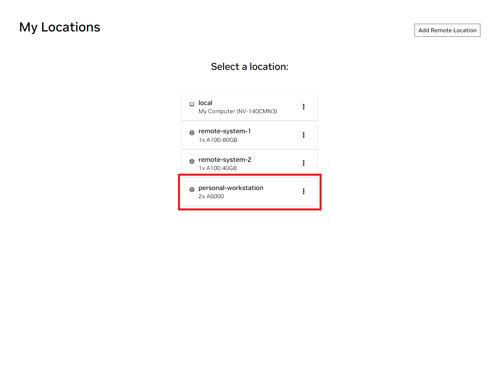
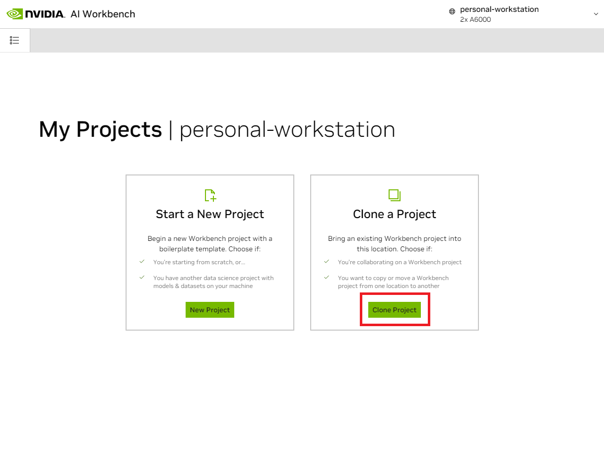
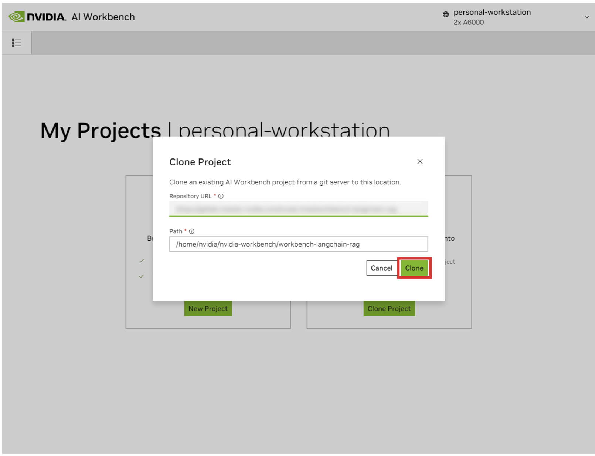
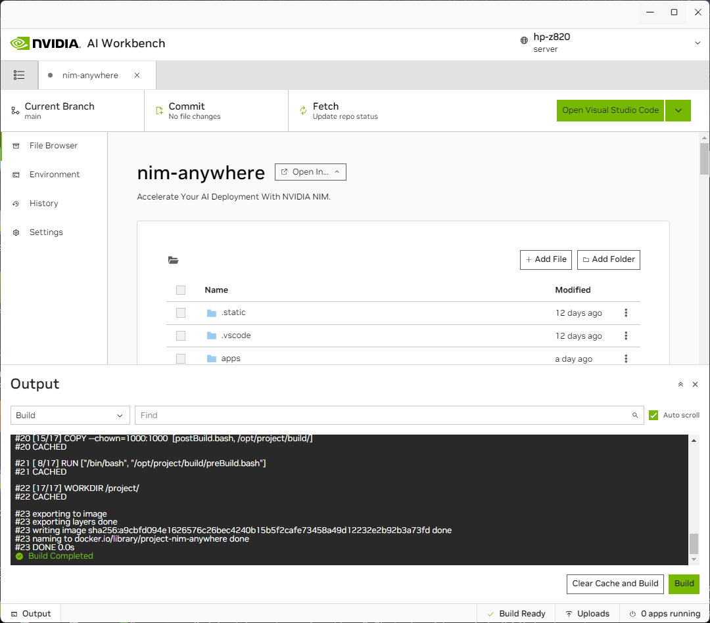
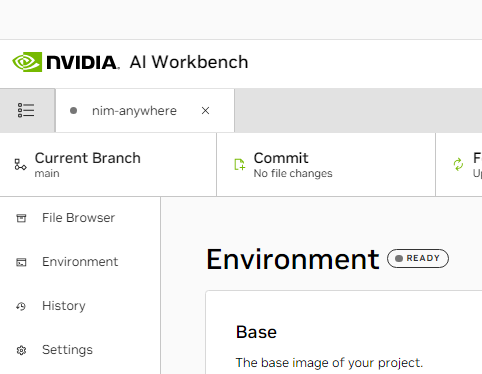
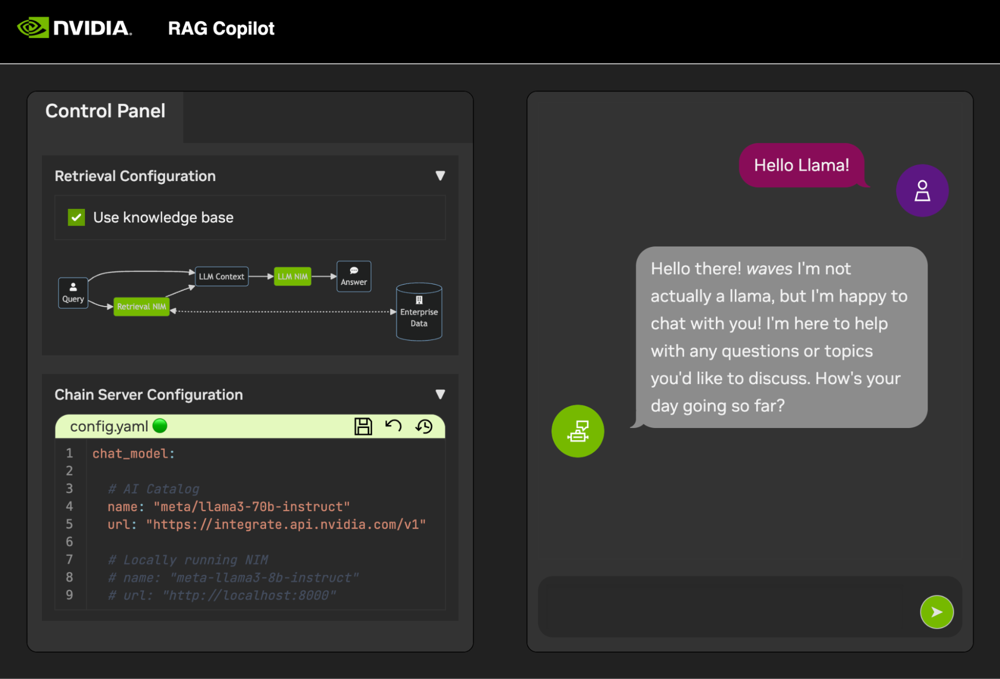

# NVIDIA NIM Anywhere

NIM Anywhere is a starting point into discovering enterprise AI. This branch is currently under heavy construction.

# NEEDS TO BE UPDATED

## Get Started

Hello world!

### Prerequisites

### Generate your NGC Personal Key

#### Install AI Workbench

### Installing

#### Download this project

There are two ways to download this project for local use: Cloning and
Forking.

Cloning this repository is the recommended way to start. This will not
allow for local modifications, but is the fastest to get started. This
also allows for the easiest way to pull updates.

Forking this repository is recommended for development as changes will
be able to be saved. However, to get updates, the fork maintainer will
have to regularly pull from the upstream repo. To work from a fork,
follow [GitHub's
instructions](https://docs.github.com/en/pull-requests/collaborating-with-pull-requests/working-with-forks/fork-a-repo)
and then reference the URL to your personal fork in the rest of this
section.

<b>Expand this section for a details on downloading this project.</b>

1.  Open the local NVIDIA AI Workbench window. From the list of
    locations displayed, select either the remote one you just set up,
    or local if you're going to work locally.

    

2.  Once inside the location, select *Clone Project*.

    

3.  In the 'Clone Project' pop up window, set the Repository URL to
    `https://github.com/NVIDIA/nim-anywhere.git`. You can leave the Path
    as the default of
    `/home/REMOTE_USER/nvidia-workbench/nim-anywhere.git`. Click
    *Clone*.\`

    

4.  You will be redirected to the new project’s page. Workbench will
    automatically bootstrap the development environment. You can view
    real-time progress by expanding the Output from the bottom of the
    window.

    

### Configure this project

The project must be configured to use your NGC personal key.

<b>Expand this section for a details on configuring this project.</b>

1.  Before running for the first time, your NGC personal key must be
    configured in Workbench. This is done using the *Environment* tab
    from the left-hand panel.

    

2.  Scroll down to the **Secrets** section and find the *NGC_API_KEY*
    entry. Press *Configure* and provide the personal key for NGC that
    was generated earlier.

### Start This Project

Even the most basic of LLM Chains depend on a few additional
microservices. These can be ignored during development for in-memory
alternatives, but then code changes are required to go to production.
Thankfully, Workbench manages those additional microservices for
development environments.

<b>Expand this section for details on starting the demo application.</b>

> **HINT:** For each application, the debug output can be monitored in
> the UI by clicking the Output link in the lower left corner, selecting
> the dropdown menu, and choosing the application of interest (or
> **Compose** for applications started via compose).

Since you can either pull NIMs and run them locally, or utilize the
endpoints from *ai.nvidia.com* you can run this project with *or*
without GPUs.

1.  The applications bundled in this workspace can be controlled by
    navigating to two tabs:

    - **Environment** \> **Compose**
    - **Environment** \> **Applications**

2.  First, navigate to the **Environment** \> **Compose** tab. If you're
    not working in an environment with GPUs, you can just click
    **Start** to run the project using a lightweight deployment. This
    default configuration will run the following containers:

    - *Milvus Vector DB*: An unstructured knowledge base

    - *Redis*: Used to store conversation histories

3.  If you have access to GPU resources and want to run any NIMs
    locally, use the dropdown menu under **Compose** and select which
    set of NIMs you want to run locally. Note that you *must* have at
    least 1 available GPU per NIM you plan to run locally. Below is an
    outline of the available configurations:

    - Local LLM (min 1 GPU required)

      - The first time the LLM NIM is started, it will take some time to
        download the image and the optimized models.
        - During a long start, to confirm the LLM NIM is starting, the
          progress can be observed by viewing the logs by using the
          *Output* pane on the bottom left of the UI.

        - If the logs indicate an authentication error, that means the
          provided *NGC_API_KEY* does not have access to the NIMs.
          Please verify it was generated correctly and in an NGC
          organization that has NVIDIA AI Enterprise support or trial.

        - If the logs appear to be stuck on `..........: Pull complete`.
          `..........: Verifying complete`, or
          `..........: Download complete`; this is all normal output
          from Docker that the various layers of the container image
          have been downloaded.

        - Any other failures here need to be addressed.

    - Local LLM + Embedding (min 2 GPUs required)

    - Local LLM + Embedding + Reranking (min 3 GPUs required)

    > **NOTE:**
    >
    > - Each profile will also run *Milvus Vector DB* and *Redis*
    > - Due to the nature of Docker Compose profiles, the UI will let
    >   you select multiple profiles at the same time. In the context of
    >   this project, selecting multiple profiles does not make sense.
    >   It will not cause any errors, however we recommend only
    >   selecting one profile at a time for simplicity.

4.  Once the compose services have been started, navigate to the
    **Environment** \> **Applications** tab. Now, the *Chain Server* can
    safely be started. This contains the custom LangChain code for
    performing our reasoning chain. By default, it will use the local
    Milvus and Redis, but use *ai.nvidia.com* for LLM, Embedding, and
    Reranking model inferencing.

5.  Once the *Chain Server* is up, the *Chat Frontend* can be started.
    Starting the interface will automatically open it in a browser
    window. If you are running any local NIMs, you can edit the config
    to connect to them via the *Chat Frontend*

### Populating the Knowledge Base

To get started developing demos, a sample dataset is provided along with
a Jupyter Notebook showing how data is ingested into a Vector Database.

1.  To import PDF documentation into the vector Database, open Jupyter
    using the app launcher in AI Workbench.

2.  Use the Jupyter Notebook at `code/upload-pdfs.ipynb` to ingest the
    default dataset. If using the default dataset, no changes are
    necessary.

3.  If using a custom dataset, upload it to the `data/` directory in
    Jupyter and modify the provided notebook as necessary.

# Contributing

## Running the tests

- lint
- ci

## Managing your Development Environment

### Environment Variables

Most of the configuration for the development environment happens with
Environment Variables. To make permanent changes to environment
variables, modify [`variables.env`](./variables.env) or use the
Workbench UI.

### Python Environment Packages

This project uses one Python environment at `/usr/bin/python3` and
dependencies are managed with `pip`. Because all development is done
inside a container, any changes to the Python environment will be
ephemeral. To permanently install a Python package, add it to the
[`requirements.txt`](./requirements.txt) file or use the Workbench UI.

### Operating System Configuration

The development environment is based on Ubuntu 22.04. The primary user
has password-less sudo access, but all changes to the system will be
ephemeral. To make permanent changes to installed packages, add them to
the \[`apt.txt`\] file. To make other changes to the operating system
such as manipulating files, adding environment variables, etc; use the
[`postBuild.bash`](./postBuild.bash) and
[`preBuild.bash`](./preBuild.bash) files.

## Updating Dependencies

It is typically good practice to update dependencies monthly to ensure
no CVEs are exposed through misused dependencies. The following process
can be used to patch this project. It is recommended to run the
regression testing after the patch to ensure nothing has broken in the
update.

1.  **Update Environment:** In the workbench GUI, open the project and
    navigate to the Environment pane. Check if there is an update
    available for the base image. If an updated base image is available,
    apply the update and rebuild the environment. Address any build
    errors. Ensure that all of the applications can start.
2.  **Update Python Packages and NIMs:** The Python dependencies and NIM
    applications can be updated automatically by running the
    `/project/code/tools/bump.sh` script.
3.  **Update Remaining applications:** For the remaining applications,
    manually check their default tag and compare to the latest. Update
    where appropriate and ensure that the applications still start up
    successfully.
4.  **Restart and rebuild the environment.**
5.  **Audit Python Environment:** It is now best to check the installed
    versions of ALL Python packages, not just the direct dependencies.
    To accomplish this, run `/project/code/tools/audit.sh`. This script
    will print out a report of all Python packages in a warning state
    and all packages in an error state. Anything in an error state must
    be resolved as it will have active CVEs and known vulnerabilities.
6.  **Check Dependabot Alerts:** Check all of the
    [Dependabot](https://github.com/NVIDIA/nim-anywhere/security/dependabot)
    alerts and ensure they should be resolved.
7.  **Regression testing:** Run through the entire demo, from document
    ingesting to the frontend, and ensure it is still functional and
    that the GUI looks correct.

# License

This project is licensed under the Apache 2.0 License  -  see the [LICENSE.txt](LICENSE.txt) file for details.
