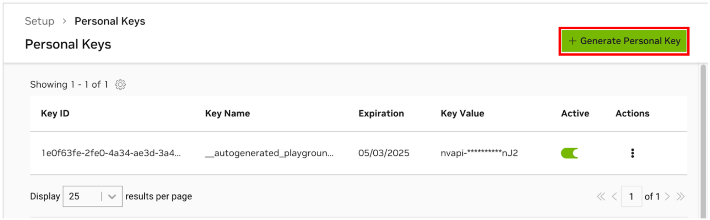
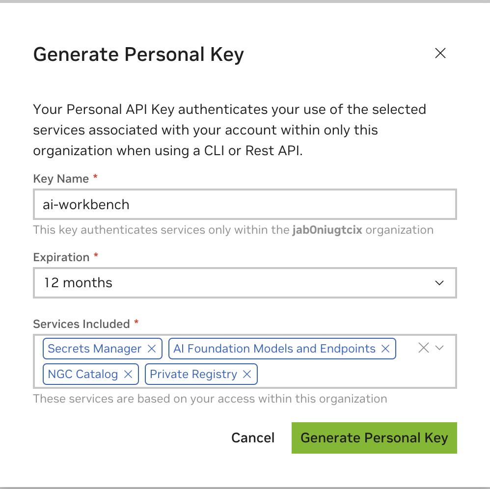
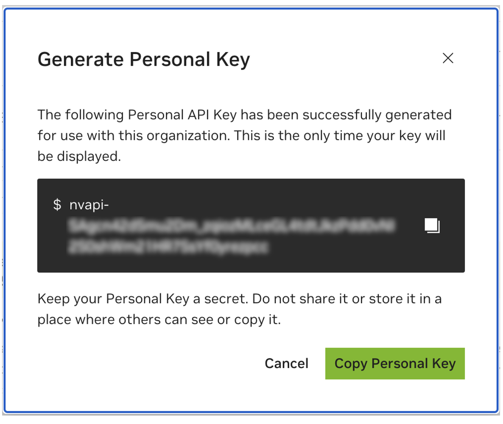

## Generate your NGC Personal Key

To allow AI Workbench to access NVIDIA’s cloud resources, you’ll need to provide it with a Personal Key. These keys begin with `nvapi-`.

<b>Expand this section for instructions for creating this key.</b>

1. Go to the [NGC Personal Key Manager](https://org.ngc.nvidia.com/setup/personal-keys). If you are prompted to, then register for a new account and sign in.

    > **HINT** You can find this tool by logging into [ngc.nvidia.com](https://ngc.nvidia.com), expanding your profile menu on the top right, selecting *Setup*, and then selecting *Generate Personal Key*.

1. Select *Generate Personal Key*.

    

1. Enter any value as the Key name, an expiration of 12 months is fine, and select all the services. Press *Generate Personal Key* when you are finished.

    

1. Save your personal key for later. Workbench will need it and there is no way to retrieve it later. If the key is lost, a new one must be created. Protect this key as if it were a password.

    

