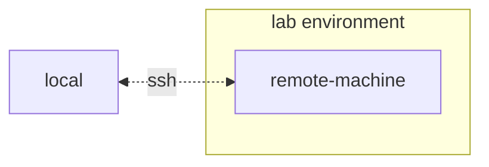

## Install AI Workbench

This project is designed to be used with [NVIDIA AI Workbench](https://www.nvidia.com/en-us/deep-learning-ai/solutions/data-science/workbench/). While this is not a requirement, running this demo without AI Workbench will require manual work as the pre-configured automation and integrations may not be available.

<b>Expand this section for setup instructions.</b>

### Overview

Typicaly, there are two different styles of developing with AI Workbench. The first, and most simple is local only development. This is usually the starting point and AI Workbench allows for native scaling later. However, this style currently only supports Ubuntu.

The second development style is using a remote lab machine for development and a thin-client for remotely accessing the development machine. This allows for compute resources to stay centrally located and for developers to be more portable. Note, the remote lab machine must run Ubuntu, but the local client can run Windows, MacOS, or Ubuntu.

For this quick start guide, it is assumed that a remote lab environment is used. If the first development style is preferred, simply skip the remote installation steps and note the Ubuntu requirement for local development.

### Client Machine Install

Ubuntu is required if the local client will also be used for developent.
