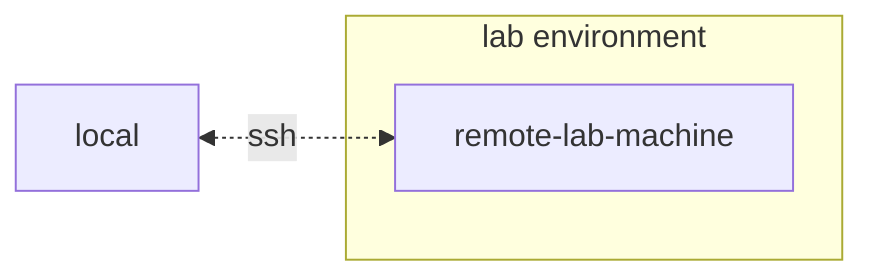

## Install AI Workbench

This project is designed to be used with [NVIDIA AI Workbench](https://www.nvidia.com/en-us/deep-learning-ai/solutions/data-science/workbench/). While this is not a requirement, running this demo without AI Workbench will require manual work as the pre-configured automation and integrations may not be available.

This quick start guide will assume a remote lab machine is being used for development and the local machine is a thin-client for remotely accessing the development machine. This allows for compute resources to stay centrally located and for developers to be more portable. Note, the remote lab machine must run Ubuntu, but the local client can run Windows, MacOS, or Ubuntu. To install this project local only, simply skip the remote install.

### Client Machine Install

Ubuntu is required if the local client will also be used for developent. When using a remote lab machine, this can be Windows, MacOS, or Ubuntu.
