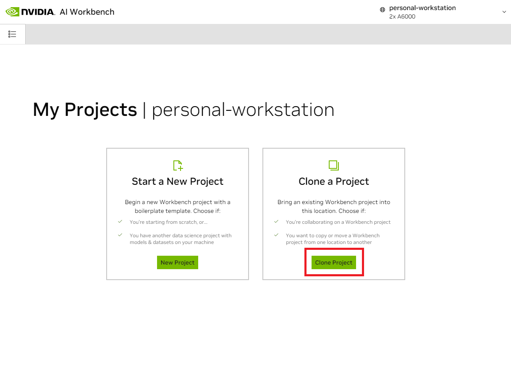
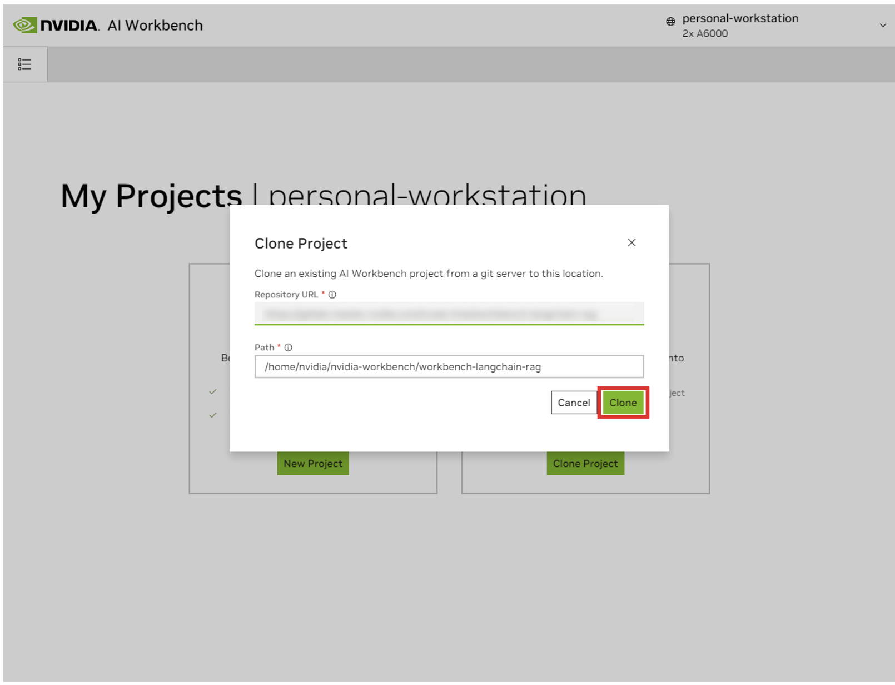
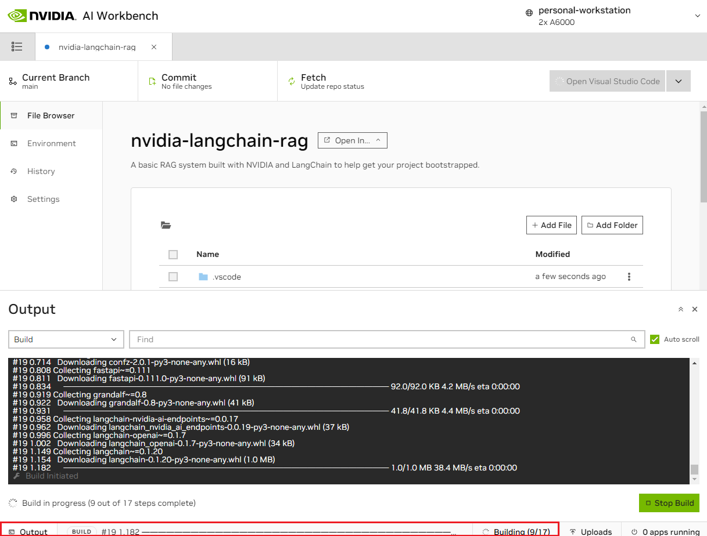

## Download this project

There are two ways to download this project for local use: Cloning and Forking.

Cloning this repository is the recommended way to start. This will not allow for local modifications, but is the fastest to get started. This also allows for the easiest way to pull updates.

Forking this repository is recommended for development as changes will be able to be saved. However, to get updates, the fork maintainer will have to regularly pull from the upstream repo. To work from a fork, follow [GitHub's instructions](https://docs.github.com/en/pull-requests/collaborating-with-pull-requests/working-with-forks/fork-a-repo) and then reference the URL to your personal fork in the rest of this section.

<b>Expand this section for a details on downloading this project.</b>

1. Open the local NVIDIA AI Workbench window. From the list of locations displayed, select either the remote one you just set up, or local if you're going to work locally.

    

1. Once inside the location, select *Clone Project*.

    

1. In the 'Clone Project' pop up window, set the Repository URL to `https://github.com/NVIDIA/nim-anywhere.git`. You can leave the Path as the default of `/home/REMOTE_USER/nvidia-workbench/nim-anywhere.git`. Click *Clone*.`

    

1. You will be redirected to the new project’s page. Workbench will automatically bootstrap the development environment. You can view real-time progress by expanding the Output from the bottom of the window.

    

