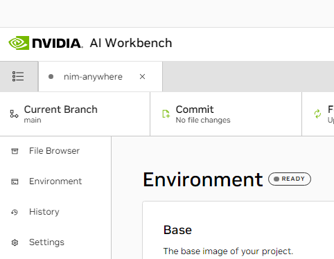
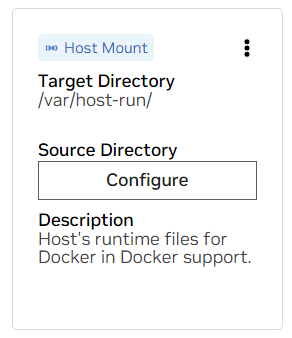
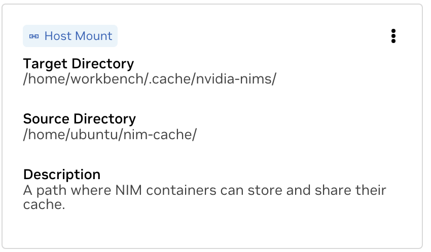

## Configure this project
The project must be configured to work with local machine resources.

<details>
<summary>
<b>Expand this section for a details on configuring this project.</b>
</summary>

1. Before running for the first time, project specific configuration must be provided. Project configuration is done using the *Environment* tab from the left-hand panel.

    

1. Scroll down to the **Variables** section and find *NGC_HOME* entry. It should be set to something like `~/.cache/nvidia-nims`. The value here is used by workbench.  This same location also appears in the **Mounts** section that mounts this directory into the container.

1. Scroll down to the **Secrets** section and find the *NGC_API_KEY* entry. Press *Configure* and provide the personal key for NGC that as generated earlier.

1. Scroll down to the **Mounts** section. Here, there are two mounts to configure.

    a. Find the mount for /var/host-run. This is used to allow the development environment to access the host’s Docker daemon in a pattern called Docker out of Docker. Press **Configure** and provide the directory `/var/run`.

    

    b. Find the mount for /home/workbench/.cache/nvidia-nims. This mount is used as a runtime cache for NIMs where they can cache model files. Sharing this cache with the host reduces disk usage and network bandwidth.

    

    If you don't already have a nim cache, or you aren't sure, use the following commands to create one at `/home/USER/.cache/nvidia-nims`.

    ```bash
    mkdir -p ~/.cache/nvidia-nims
    chmod 2777 ~/.cache/nvidia-nims
    ```

1. A rebuild will occur after these settings have been changed.

1. Once the build completes with a *Build Ready* message, all applications will be made available to you.

</details>
