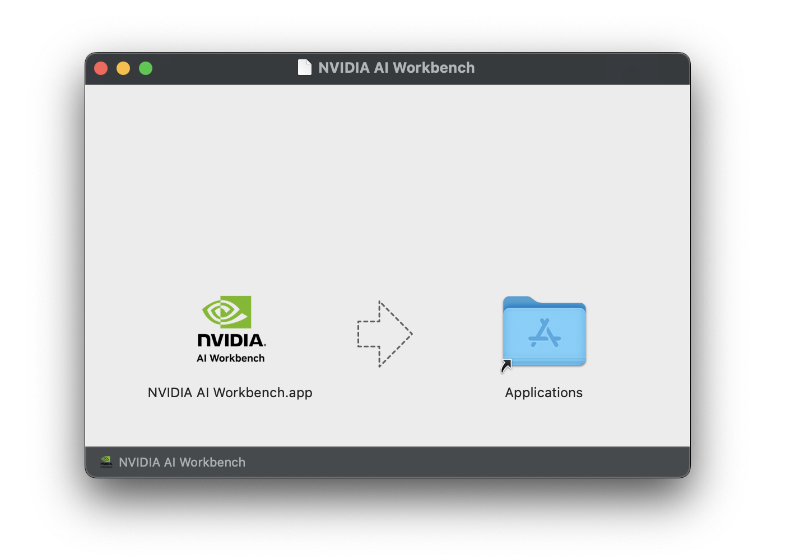

<b>Expand this section for a MacOS install.</b>

For full instructions, see the [NVIDIA AI Workbench User Guide](https://docs.nvidia.com/ai-workbench/user-guide/latest/installation/macos.html).

1. Install Prerequisite Software
    1. Install [Docker Desktop](https://www.docker.com/products/docker-desktop/) for local container support. Please be mindful of Docker Desktop's licensing for enterprise use. [Rancher Desktop](https://rancherdesktop.io/) may be a viable alternative.
    1. *[OPTIONAL]* If Visual Studio Code integration is desired, install [Visual Studio Code](https://code.visualstudio.com/). When using VSCode on a Mac, an a[dditional step must be performed](https://code.visualstudio.com/docs/setup/mac#_launching-from-the-command-line) to install the VSCode CLI interface used by Workbench.

1. Download the [NVIDIA AI Workbench](https://www.nvidia.com/en-us/deep-learning-ai/solutions/data-science/workbench/) disk image (*.dmg* file) and open it.

1. Drag AI Workbench into the Applications folder and run *NVIDIA AI Workbench* from the application launcher.
    

1. Select Docker as your container runtime.

1. Log into your GitHub Account by using the *Sign in through GitHub.com* option.

1. Enter your git author information if requested.

