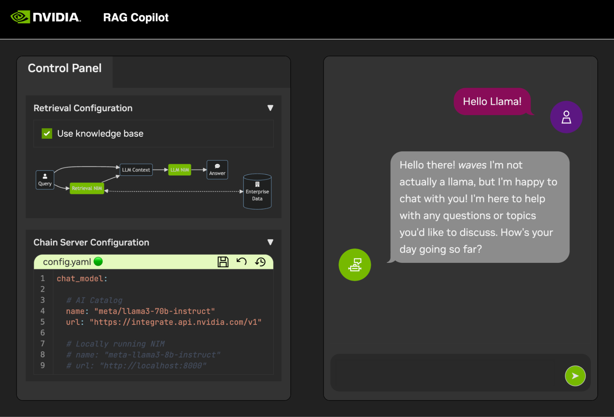

## Start This Project

Even the most basic of LLM Chains depend on a few additional microservices. These can be ignored during development for in-memory alternatives, but then code changes are required to go to prodoction. Thankfully, Workbench manages those additional microservices for development environments.

<b>Expand this section for details on starting the demo application.</b>

> **HINT:** For each application, the debug output can be monitored in the UI by clicking the Output link in the lower left corner, selecting the dropdown menu, and choosing the application of interest.

1. All applications bundled in this workspace can be controlled by navigating to **Environment** > **Applications**.

1. First, toggle on *Milvus Vector DB* and *Redis*. Milvus is used as an unstructured knowledge base and Redis is used to store conversation histories.

1. Once these services have been started, the *Chain Server* can safely be started. This contains the custom LangChain code for performing our reasoning chain. By default, it will use the local Milvus and Redis, but use *ai.nvidia.com* for LLM and Embedding model inferencing.

1. **[OPTIONAL]:** Next, start the *LLM NIM*. The first time the LLM NIM is started, it will take some time to download the image and the optimized models.

    a. During a long start, to confirm the LLM NIM is starting, the progress can be observed by viewing the logs by using the *Output* pane on the bottom left of the UI.

    b. If the logs indicate an authentication error, that means the provided *NGC_API_KEY* does not have access to the NIMs. Please verify it was generated correctly and in an NGC organization that has NVIDIA AI Enterprise support or trial.

    c. If the logs appear to be stuck on `..........: Pull complete`. `..........: Verifying complete`, or `..........: Download complete`; this is all normal output from Docker that the various layers of the container image have been downloaded.

    d. Any other failures here need to be addressed.

1. Once the *Chain Server*  is up, the *Chat Interface* can be started. Starting the interface will automatically open it in a browser window.

  

