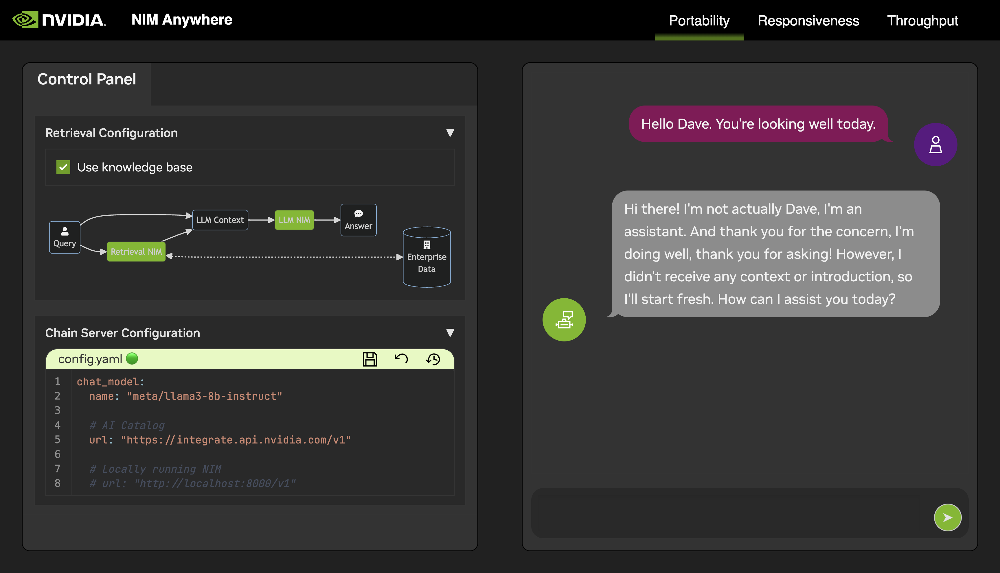
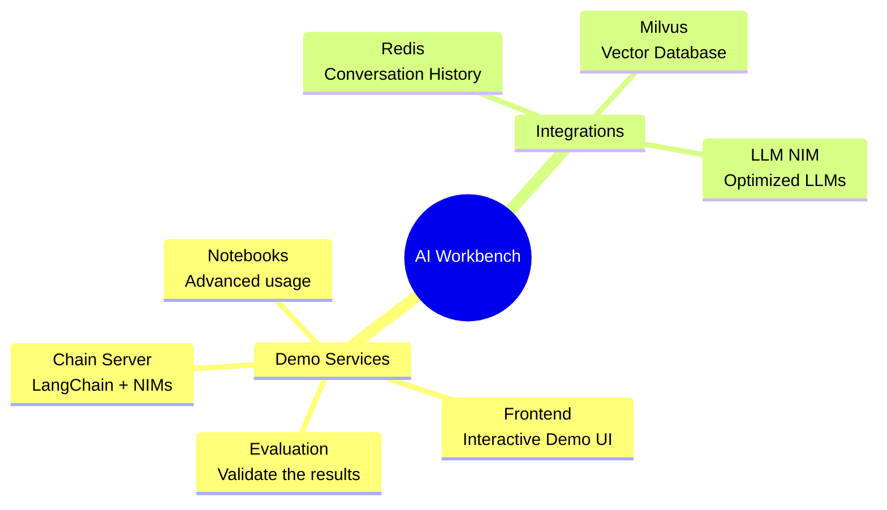

# NIM Anywhere Developer Documentation

NIM Anywhere serves two purposes as a rapid NVIDIA NIM demonstrator as well as a starting point for developing with NIMs.
The intention is to democratize access to NIMs and demonstrate the value of NIMs.

## Project Components

This project contains applications for a few demo services as well as integrations with external services. These are all orchestrated by [NVIDIA AI Workbench](https://www.nvidia.com/en-us/deep-learning-ai/solutions/data-science/workbench/).

The demo services are all in the `code` folder. The root level of the code folder has a few interactive notebooks meant for technical deep dives. The Chain Server is a sample application utilizing NIMs with LangChain. The Chat Frontend folder contains an interactive UI server for excersising the chain server. Finally, sample notebooks are provided in the Evaluation directory to demonstrate retriveval scoring and validation.

