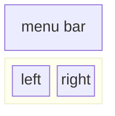
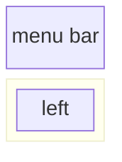

## Updating the frontend

The frontend has been designed in an effort to minimize the required HTML and Javascript development. A branded and styled Application Shell is provided that has been created with vanilla HTML, Javascript, and CSS. It is designed to be easy to customize, but it should never be required. The interactive components of the frontend are all created in Gradio and mounted in the app shell using iframes.

Along the top of the app shell is a menu listing the available views. Each view may have its own layout consisting of one or a few pages.

### Creating a new page

Pages contain the interactive components for a demo. The code for the pages is in the `code/frontend/pages` directory. To create a new page:

1. Create a new folder in the pages directory
1. Create an `__init__.py` file in the new directory that uses Gradio to define the UI. The Gradio Blocks layout should be defined in a variable called `page`.
1. It is recommended that any CSS and JS files needed for this view be saved in the same directory. See the `chat` page for an example.
1. Open the `code/frontend/pages/__init__.py` file, import the new page, and add the new page to the `__all__` list.

> **NOTE:** Creating a new page will not add it to the frontend. It must be added to a view to appear on the Frontend.

### Adding a view

View consist of one or a few pages and should function independently of each other. Views are all defined in the `code/frontend/server.py` module. All declared views will automatically be added to the Frontend's menu bar and made available in the UI.

To define a new view, modify the list named `views`. This is a list of `View` objects. The order of the objects will define their order in the Frontend menu. The first defined view will be the default.

View objects describe the view name and layout. They can be declared as follow:
```python
my_view = frontend.view.View(
  name="My New View",  # the name in the menu
  left=frontend.pages.sample_page,  # the page to show on the left
  right=frontend.pages.another_page,  # the page to show on the right
)
```

All of the page declarations, `View.left` or `View.right`, are optional. If they are not declared, then the associated iframes in the web layout will be hidden. The other iframes will expand to fill the gaps. The following diagrams show the various layouts.

  - All pages are defined



  - Only left is defined



### Frontend branding

The frontend contains a few branded assets that can be customized for different use cases.

#### Logo

The frontend contains a logo on the top left of the page. To modify the logo, an SVG of the desired logo is required. The app shell can then be easily modified to use the new SVG by modifying the `code/frontend/_assets/index.html` file. There is a single `div` with an ID of `logo`. This box contains a single SVG. Update this to the desired SVG definition.

```html
<div id="logo" class="logo">
    <svg viewBox="0 0 164 30">...</svg>
</div>
```

#### Color scheme

The styling of the App Shell is defined in `code/frontend/_static/css/style.css`. The colors in this file may be safely modified.

The styling of the various pages are defined in `code/frontend/pages/*/*.css`. These files may also require modification for custom color schemes.

#### Gradio theme

The Gradio theme is defined in the file `code/frontend/_assets/theme.json`. The colors in this file can safely be modified to the desired branding. Other styles in this file may also be changed, but may cause breaking changes to the frontend. The [Gradio documentation](https://www.gradio.app/guides/theming-guide) contains more information on Gradio theming.

### Messaging between pages

> **NOTE:** This is an advanced topic that most developers will never require.

Occasionally, it may be necessary to have multiple pages in a view that communicate with each other. For this purpose, Javascript's `postMessage` messaging framework is used. Any trusted message posted to the application shell will be forwarded to each iframe where the pages can handle the message as desired. The `control` page uses this feature to modify the configuration of the `chat` page.

The following will post a message to the app shell (`window.top`). The message will contain a dictionary with the key `use_kb` and a value of true. Using Gradio, this Javascript can be executed by [any Gradio event](https://www.gradio.app/guides/custom-CSS-and-JS#adding-custom-java-script-to-your-demo).

```javascript
window.top.postMessage({"use_kb": true}, '*');
```

This message will automatically be sent to all pages by the app shell. The following sample code will consume the message on another page. This code will run asynchronously when a `message` event is received. If the message is trusted, a Gradio component with the `elem_id` of `use_kb` will be updated to the value specified in the message. In this way, the value of a Gradio component can be duplicated across pages.

```javascript
window.addEventListener(
  "message",
  (event) => {
      if (event.isTrusted) {
          use_kb = gradio_config.components.find((element) => element.props.elem_id == "use_kb");
          use_kb.props.value = event.data["use_kb"];
      };
  },
  false);
```
