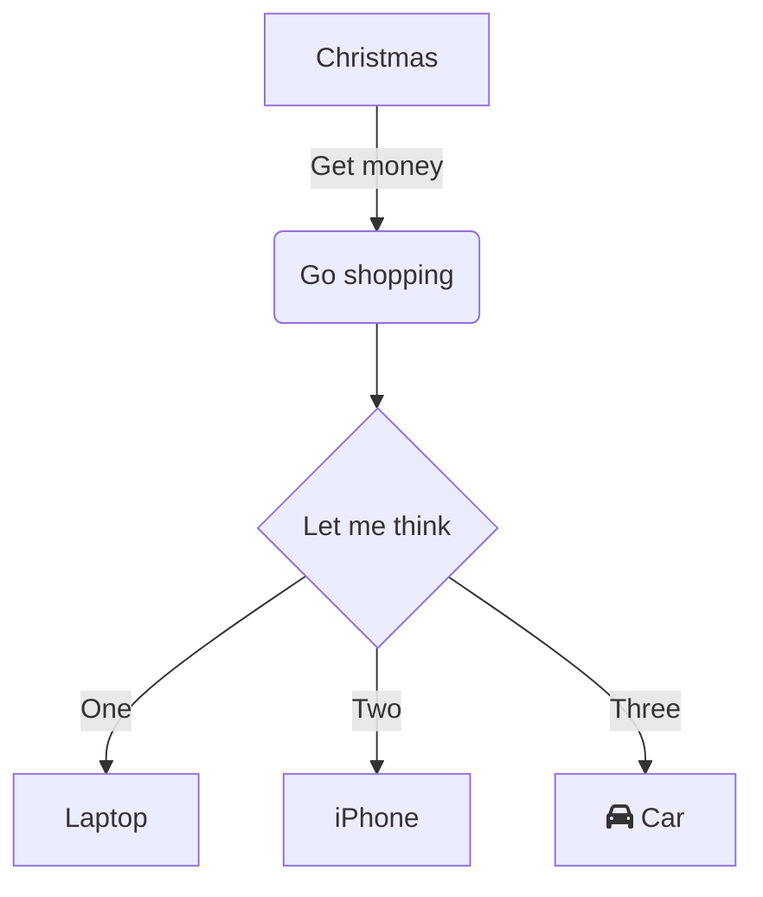

## Updating documentation

Documentation is written in Markdown format and then rendered to HTML using Pandoc. The documentation can be opened using the application drawer to start the Documentation server. Restarting the documentation server will update the documentation to reflect changes.

All documentation is in the `docs` folder. Any markdown files in this folder will be concatenated, in alphabetic order, to produce the full manual.

Save all static content, including images, to the `_static` folder. Static content outside of this folder may work in Markdown format, but will break in HTML format.

### Dynamic documentation

It may be helpful to have documents that update and write themselves. To create a dynamic document, simply create a Python script with the `.md.py` extension. The script must be executable and should write the Markdown formatted document to stdout. During build time, this script will be run to update the markdown file with the same name.

### HTML template

There are two files that control the template.

- `.template.html` is the HTML template used by Pandoc. It is based heavily on a project called [Easy Pandoc Templates](https://github.com/ryangrose/easy-pandoc-templates). This file can be customized or replaced to change how to documentation looks. For tips on doing this, check out the [Pandoc documentation](https://pandoc.org/MANUAL.html#templates).
- `.puppeteer.json` is a configuration file used in Mermaid rendering. There is not likely to be a situation where modifying this is necessary.

### Publishing documentation

`Make` can be used to manage the lifecycle of the documentation.

- `make render` will render all of the dynamic documentation pages to Markdown
- `make build` will build the documentation HTML from Markdown
- `make clean` will clean all cached builds
- `make serve` will start a local webserver for viewing the documentation
- `make stop` will stop a running webserver
- `make status` will check the status of the webserver

### Mermaid support

The documentation supports creating dynamic flowcharts using mermaid. This is done using the [mermaid-filter](https://github.com/raghur/mermaid-filter) extension for Pandoc. To include a diagram in your documentation, include something like this:

~~~markdown

~~~

For help with the Mermaid syntax, reference the [Mermaid documentation](https://mermaid.js.org/intro/) and check out the [Mermaid Live Editor](https://mermaid.live/).
